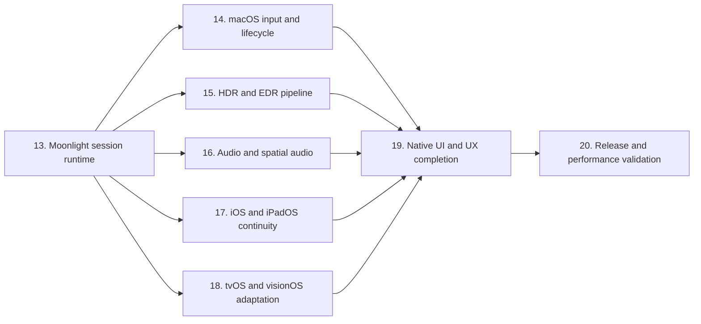

# LuneX 端到端完成路线图

> 当前 App 仍处于 fail-closed 状态。已有类型、策略、编译通过或单元测试通过，不等同于真实 Moonlight 工作流完成。

## 完成口径

任何功能只有同时满足以下条件才可标记完成：

1. 已接入生产 App 运行路径，而不是只有独立类型或测试 stub。
2. 在真实 session 生命周期中工作，并能正确取消和释放资源。
3. 有确定性单元/fixture 测试。
4. 有目标 Apple 平台的运行证据。
5. 涉及 Sunshine 互操作时，有显式授权的 live-host 端到端证据。
6. 构建通过、首次帧出现或策略 resolver 返回预期值都不能单独作为完成证明。

## 依赖顺序

## 实施阶段

| 阶段 | OpenSpec change | 主要交付 | 开始条件 | 完成证明 |
|---|---|---|---|---|
| 13 | `implement-moonlight-session-runtime` | 原生 identity/pairing、RTSP/control、视频、音频、输入 transport | 当前即可开始 | 配对、持续视频、同步音频、输入、重连、停止全链路 |
| 14 | `integrate-macos-native-input-lifecycle` | `NSEvent`、cursor hide/capture、相对鼠标、焦点释放、decoder/renderer 后台节流 | 阶段 13 输入与媒体通道可用 | key/occlusion/screen/resize 在真实 stream 中生效 |
| 15 | `implement-native-hdr-edr-pipeline` | 10-bit decode、BT.2020/PQ、MDCV/CLL、EDR metadata、tone mapping | 阶段 13 能保留 HDR metadata | HDR/SDR 显示器、headroom 变化、窗口换屏实测 |
| 16 | `integrate-spatial-audio-runtime` | Opus/PCM graph、route detection、environment node、head tracking entitlement | 阶段 13 音频稳定 | 兼容 AirPods/扬声器 route 实测和无权限降级 |
| 17 | `integrate-mobile-scene-pip-continuity` | scenePhase、iPad resize、Stage Manager、PiP、后台 audio、移动 EDR | 阶段 13 session 可暂停/恢复 | iPhone/iPad 真机前后台、PiP、窗口 resize 证据 |
| 18 | `complete-tvos-visionos-runtime-adaptation` | tvOS remote/focus、平台 HDR 策略、visionOS window/audio/input | 阶段 13 核心 provider 平台化 | 各目标设备真实或受支持模拟器工作流 |
| 19 | `complete-native-product-workflows` | pairing/错误恢复、stream controls、overlay、设置、辅助功能和多窗口 UX | 阶段 14–18 的能力稳定 | 关键任务可达性、VoiceOver、键盘和窗口回归 |
| 20 | `validate-release-performance-quality` | 延迟、功耗、内存、热状态、弱网、长时运行、Release signing | 阶段 19 完成 | 真机测量、无泄漏、长时稳定和发布构建 |

## 阶段 14：macOS 原生输入与生命周期

- 把 `AppKitLifecycleMonitor` 输出同时接入 renderer、decoder、frame queue 和 input capture。
- occluded/minimized 时停止 drawable acquisition 和帧提交，降低或暂停解码，但保持可恢复的 session/control 状态。
- `didBecomeKey` 后按用户设置启用远程鼠标；`didResignKey` 立即显示系统鼠标并发送 held key/button release。
- 使用真实 `NSEvent` 采集键盘、相对/绝对鼠标、滚轮和按钮。
- 换屏、backing scale 和 resize 后，以实际 decoded source size 与 drawable video rect 更新统一 `RenderTransform`。

## 阶段 15：HDR 和 EDR

- 把 `display supports EDR` 与 `stream is HDR` 拆为两个独立状态。
- 从解码 format description 保留 bit depth、primaries、transfer function、matrix、MDCV 和 CLL。
- 配置 10-bit Metal 输出、目标 colorspace 和 EDR metadata。
- 明确 PQ/reference white 到当前 `maximumExtendedDynamicRangeColorComponentValue` 的映射策略。
- 覆盖 SDR-on-HDR、HDR-on-SDR、EDR headroom 动态变化和窗口跨屏。
- tvOS/visionOS 不复用不可用的 macOS layer API，分别制定受支持输出路径。

## 阶段 16：空间音频

- 将 session 音频 decoder 的 PCM 接入一个真实 `AVAudioEngine` graph。
- 把 `AVAudioEnvironmentNode` 放入 graph，而不是只实例化 controller。
- 根据 route、channel layout、用户设置和 entitlement 决定 spatial/head tracking。
- 在 macOS、iOS、tvOS 使用 `isListenerHeadTrackingEnabled`；visionOS 采用平台支持的空间音频路径。
- route/interruption 变化后无泄漏地重建 graph，并将降级原因展示在 diagnostics。

## 阶段 17：iOS/iPadOS 连续性

- RootView 接入 `scenePhase`、实际 `UIWindowScene`、screen、scale 和几何变化。
- iPad Stage Manager 与多窗口 resize 实时更新 drawable、input transform 和 decoder output policy。
- 使用 `AVPictureInPictureController` 和有效 content source 实现真实 PiP。
- 后台只在 audio/PiP 合法路径下保活；无合法路径时明确暂停或断开。
- 从实际 `UIScreen.currentEDRHeadroom` 更新移动 render state。
- 真机验证锁屏、来电/音频中断、前后台、PiP、外接屏和窗口恢复。

## 风险门

| 风险 | 计划控制 |
|---|---|
| GPL 污染 | 保持 clean-room；任何 C core 复用另立许可证 change |
| Sunshine 协议范围过大 | 先支持指定当前 Sunshine 版本，再扩展兼容矩阵 |
| live-host 测试破坏用户 session | 全部 opt-in、指定测试 app、可审计 stop/cleanup |
| Keychain 重复授权 | 正常测试继续使用文件/in-memory store；真实 Keychain 不重复运行 |
| 模拟器重复实例 | 固定设备 ID，串行构建/运行，每类设备最多一个 |
| “骨架完成”再次被误报 | 每个 change 都要求生产接线与端到端证据 |
