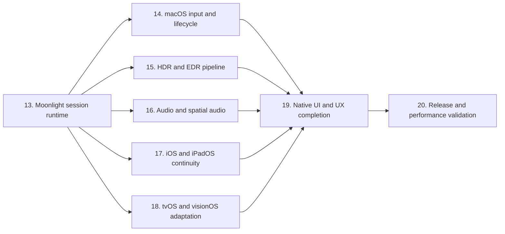

# LuneX 端到端完成路线图

> 当前 App 仍处于 fail-closed 状态。已有类型、策略、编译通过或单元测试通过，不等同于真实 Moonlight 工作流完成。

## 完成口径

任何功能只有同时满足以下条件才可标记完成：

1. 已接入生产 App 运行路径，而不是只有独立类型或测试 stub。
2. 在真实 session 生命周期中工作，并能正确取消和释放资源。
3. 有确定性单元/fixture 测试。
4. 有目标 Apple 平台的运行证据。
5. 涉及 Sunshine 互操作时，有显式授权的 live-host 端到端证据。
6. 构建通过、首次帧出现或策略 resolver 返回预期值都不能单独作为完成证明。

## 依赖顺序

## 当前执行状态（2026-07-21）

| 阶段 | 状态 | 已证明 | 尚未证明/阻塞条件 |
|---|---|---|---|
| 13 | `in_progress`，OpenSpec `54/61` | identity、pairing/RTSP/control协议实现，video/audio处理管线，remote input runtime，统一session ownership，离线fixture、五平台Debug/Release、ASan/TSan/resource gates | production仍缺video/audio network receiver；指定Sunshine版本清单、live pairing、持续视频、可听同步音频、host实际接收输入/feedback和完整E2E均无授权证据 |
| 14 | `in_progress`，OpenSpec `28/29` | 完成AppKit合同、共享坐标、闭合directive、generation-scoped lifecycle、AppModel/media application、active input coordinator、actual direct/relative capture、balanced cursor ownership、responder/dismantle、stream-view backing/display/live-resize检测、privacy-bounded diagnostics、application/normal/五平台Debug+Release、strict/generator/analyzer/sanitizer/resource及simulator独立门 | 授权Sunshine与鼠标/多显示器硬件证明尚未完成 |
| 15 | `in_progress`，OpenSpec `7/33` | color/luminance foundation及immutable decoded/Metal frame binding完成 | mapper完整验证、revisioned queue、shader、production presenter、float surface、动态跨屏和物理显示器验证仍待完成 |
| 16 | `pending` | 已有PCM graph、route恢复与head-tracking capability policy | 尚无session-owned environment graph、实际`isListenerHeadTrackingEnabled`接线、entitlement/route硬件验证 |
| 17 | `pending` | 已有continuity policy与UIKit lifecycle类型 | 尚无scene/window geometry、Stage Manager、PiP content source、合法后台保活或移动EDR运行接线 |
| 18 | `pending` | tvOS/visionOS target与基础adapter可构建 | 尚无平台媒体、输入、HDR、空间音频和设备工作流证据 |
| 19 | `pending` | 原生SwiftUI host/app/settings/diagnostics基础界面可构建 | 尚无完整stream controls、恢复UX、多窗口、VoiceOver与键盘/触控任务回归 |
| 20 | `pending` | Release配置与sanitizer静态门禁可执行 | 尚无签名发布包、端到端延迟、功耗、热状态、弱网、内存基线与长时真机证据 |

阶段 14–20 的确定性实现和离线测试可以在阶段 13 的 live gate 等待期间推进，但不得因此把依赖真实host、显示器、音频route、移动设备或签名账户的完成证明标记为通过。阶段 13 保持 `in_progress`，直到 `1.1`、`3.7`、`5.8`、`6.7`、`7.7`、`9.2`、`9.3` 全部取得授权证据。

## 实施阶段

| 阶段 | OpenSpec change | 主要交付 | 开始条件 | 完成证明 |
|---|---|---|---|---|
| 13 | `implement-moonlight-session-runtime` | 原生 identity/pairing、RTSP/control、视频、音频、输入 transport | 当前即可开始 | 配对、持续视频、同步音频、输入、重连、停止全链路 |
| 14 | `integrate-macos-native-input-lifecycle` | `NSEvent`、cursor hide/capture、相对鼠标、焦点释放、decoder/renderer 后台节流 | 阶段 13 输入与媒体通道可用 | key/occlusion/screen/resize 在真实 stream 中生效 |
| 15 | `implement-native-hdr-edr-pipeline` | 10-bit decode、BT.2020/PQ、MDCV/CLL、EDR metadata、tone mapping | 阶段 13 能保留 HDR metadata | HDR/SDR 显示器、headroom 变化、窗口换屏实测 |
| 16 | `integrate-spatial-audio-runtime` | Opus/PCM graph、route detection、environment node、head tracking entitlement | 阶段 13 音频稳定 | 兼容 AirPods/扬声器 route 实测和无权限降级 |
| 17 | `integrate-mobile-scene-pip-continuity` | scenePhase、iPad resize、Stage Manager、PiP、后台 audio、移动 EDR | 阶段 13 session 可暂停/恢复 | iPhone/iPad 真机前后台、PiP、窗口 resize 证据 |
| 18 | `complete-tvos-visionos-runtime-adaptation` | tvOS remote/focus、平台 HDR 策略、visionOS window/audio/input | 阶段 13 核心 provider 平台化 | 各目标设备真实或受支持模拟器工作流 |
| 19 | `complete-native-product-workflows` | pairing/错误恢复、stream controls、overlay、设置、辅助功能和多窗口 UX | 阶段 14–18 的能力稳定 | 关键任务可达性、VoiceOver、键盘和窗口回归 |
| 20 | `validate-release-performance-quality` | 延迟、功耗、内存、热状态、弱网、长时运行、Release signing | 阶段 19 完成 | 真机测量、无泄漏、长时稳定和发布构建 |

## 阶段 14：macOS 原生输入与生命周期

- `docs/runtime/macos-input-lifecycle-contract.md`是AppKit输入、键码翻译、cursor平衡、坐标revision和多窗口generation所有权的实现合同；`NSEvent.keyCode`禁止直接写入远端wire。
- `StreamCoordinateSnapshotPublisher`只在source/drawable/mode变化时递增revision，无效geometry或revision溢出清空snapshot；`StreamVideoRectangleResolver`统一产出fit letterbox与fill source crop。`StreamMetalPresenter`与`InputMapper`现消费同一个immutable snapshot，texture尺寸与snapshot不一致时只清屏，fit黑边输入直接拒绝。
- 把 `AppKitLifecycleMonitor` 输出同时接入 renderer、decoder、frame queue 和 input capture。
- occluded/minimized 时停止 drawable acquisition 和帧提交，降低或暂停解码，但保持可恢复的 session/control 状态。
- `didBecomeKey` 后按用户设置启用远程鼠标；`didResignKey` 立即显示系统鼠标并发送 held key/button release。
- 使用真实 `NSEvent` 采集键盘、相对/绝对鼠标、滚轮和按钮。
- 换屏、backing scale 和 resize 后，以实际 decoded source size 与 drawable video rect 更新统一 `RenderTransform`。
- lifecycle application只在generation/revision reservation仍有效且processor effect成功后发布；相同pending application共享一个effect，更高revision、stop和同UUID replacement均能阻止悬挂旧effect回写。
- `ApplicationInputSink`只接受typed event；AppModel在media owner启动时内部固定generation，environment在provider调用前再次验证session、generation与input readiness，调用方不能伪造或沿用replacement generation。
- `MacSessionInputCoordinator`以同步main-actor admission接收冻结的platform sample与coordinate/cursor/shortcut策略；固定容量环形FIFO将in-flight计入backpressure，每个generation仅一个consumer按序调用application sink，旧token不能进入replacement。
- focus loss同步关闭新sample admission但不停止accepted FIFO drain；同代只执行一个generation-scoped `releaseAll` barrier，回焦必须等屏障成功，旧release在provider suspension前后均不能越过replacement ownership fence。
- send/input-channel failure、stop、remote termination、detach与replacement共享terminal path；它关闭admission、丢弃未开始sample、一次cleanup并等待当前delivery/release，async activation及其并发调用不能跨代遗留consumer。
- `MacCursorCaptureOwner`只逆转自身成功取得的状态：relative capture先成功解除pointer association再隐藏cursor，重复apply/release幂等；association恢复失败时仍立即unhide，并保留association ownership供后续cleanup重试。实际surface通过共享lease broker调用`NSCursor.hide/unhide`与`CGAssociateMouseAndMouseCursorPosition`；replacement先取得lease后，旧dismantle不能恢复新surface的cursor ownership。
- `MacStreamInputCaptureView`是macOS-only flipped first responder，直接override key/flags/key-equivalent事件并同步产出值样本；左右modifier独立跟踪，repeat不伪造key-up，reserved shortcut分类跨key-up保留，Escape始终本地并触发一次capture-exit callback。`MacVirtualKeyTranslator`只输出明确的Win32 VK映射，未知或语义不确定的macOS key fail closed。
- `MacStreamInputCaptureView`现直接继承`MTKView`并成为SwiftUI实际Metal stream surface；surface attachment owner跟随真实window attach/detach，清理callback、transient input、Metal delegate与presentation pause。共享attachment/cursor lease阻止旧coordinator迟到dismantle清除replacement lifecycle或cursor ownership。actual stream-view backing geometry、active-session handler、admission和cursor eligibility均已接入。
- enabled capture在附着或点击actual surface时幂等请求first responder；disabled默认不抢焦点，关闭admission或dismantle只在surface自身持有时释放responder，并清transient tracking。重复dismantle显式关闭admission且不会重放事件或再次清理replacement。
- lifecycle monitor现同时绑定current window与actual Metal surface；drawable从`surface.convertToBacking(surface.bounds)`派生并同步到`MTKView`。surface frame/bounds、window resize/end-live-resize/screen/backing和application screen-parameter变化均重新读取当前screen EDR与surface pixels；旧render coordinate snapshot不再反向覆盖actual drawable。
- AppModel以单一revision-aware pump缓存并应用lifecycle到当前media generation；negotiated decoded source、actual drawable与display headroom形成同一render/input snapshot。input readiness激活generation-owned coordinator，focus loss执行ordered release barrier，stop/reconnect/remote termination/channel failure终止generation，actual surface sample只进入AppModel。session/input readiness/lifecycle/geometry共同决定admission；持久化设置独立选择relative或direct映射与supported shortcut forwarding，Escape只退出relative capture。
- DiagnosticsStore分别保留bounded审计历史与可清理的current action；stream overlay只读取当前stream action，pairing重试/成功清理旧pairing action。macOS lifecycle/input以固定code、无UUID/endpoint/display/坐标/按键payload且按语义状态去重；input generation恢复只清input action，focus/occlusion不误清decoder/audio fatal，stop/disconnect清current stream action但保留历史。provider send/release失败用独立failed gate立即关闭surface admission，同时保留generation token完成后续teardown。

### 阶段 14 当前验收边界

- OpenSpec当前`28/29 in_progress`。任务1.1至6.4与6.6均有确定性实现和离线验收；6.5未执行，因此change不可archive、阶段不可标记`complete`。
- normal macOS suite为`470 total / 469 passed / 1 explicit Keychain skip / 0 failed`；唯一skip是已完成一次授权验证后禁用的真实Keychain round-trip，不存在被禁用后冒充通过的live-host XCTest。
- macOS及固定iPhone/iPad/tvOS/visionOS的Debug/Release十构建零编译诊断；ASan和TSan完整suite各为`469 passed + 1 Keychain skip`且零sanitizer报告，malloc/resource选择集`250/250`。固定ENet analyzer风险仍为两配置一致的4项，仓库自有bridge为0项。
- simulator构建前、构建后和独立读回三份规范化快照逐字节一致；固定四个名称/UUID各唯一、可用且`Shutdown`，全部available simulator的`Booted=0`，未创建或显式启动设备。
- 6.5必须在授权Sunshine版本和测试app上，用物理键盘与鼠标逐项确认key down/up、direct/relative移动、按钮、双轴scroll、focus release、occlusion后台节流与visible resume、连续resize和至少两个不同scale/display的坐标映射；同时关联客户端隐私诊断与host实际receipt。没有该证据时，fixture/fake provider、编译、模拟器、窗口通知单测和本机UI观察都不能替代通过。
- 阶段15至20的确定性实现可继续推进，但不得借后续HDR、音频、移动或产品工作流测试回填6.5，也不得改变阶段13的7项live/hardware未完成状态。
- 独立阶段级离线自验在已推送`3ef99ee`上通过：全新DerivedData完整macOS suite为`470 total / 469 passed / 1 Keychain skip / 0 failed`且日志零诊断，OpenSpec strict `5/5`、project generator hash稳定、固定simulator仍全部`Shutdown`。该自验不改变6.5 pending或阶段`in_progress`状态。

## 阶段 15：HDR 和 EDR

- OpenSpec `implement-native-hdr-edr-pipeline`当前`7/33`；第1组color/luminance foundation、deterministic gates及2.1 immutable frame binding完成，下一项2.2强化mapper验证。
- 把 `display supports EDR` 与 `stream is HDR` 拆为两个独立状态。
- 从解码 format description 保留 bit depth、primaries、transfer function、matrix、MDCV 和 CLL。
- 配置 10-bit Metal 输出、目标 colorspace 和 EDR metadata。
- 明确 PQ/reference white 到当前 `maximumExtendedDynamicRangeColorComponentValue` 的映射策略。
- 覆盖 SDR-on-HDR、HDR-on-SDR、EDR headroom 动态变化和窗口跨屏。
- tvOS/visionOS 不复用不可用的 macOS layer API，分别制定受支持输出路径。

## 阶段 16：空间音频

- 将 session 音频 decoder 的 PCM 接入一个真实 `AVAudioEngine` graph。
- 把 `AVAudioEnvironmentNode` 放入 graph，而不是只实例化 controller。
- 根据 route、channel layout、用户设置和 entitlement 决定 spatial/head tracking。
- 在 macOS、iOS、tvOS 使用 `isListenerHeadTrackingEnabled`；visionOS 采用平台支持的空间音频路径。
- route/interruption 变化后无泄漏地重建 graph，并将降级原因展示在 diagnostics。

## 阶段 17：iOS/iPadOS 连续性

- RootView 接入 `scenePhase`、实际 `UIWindowScene`、screen、scale 和几何变化。
- iPad Stage Manager 与多窗口 resize 实时更新 drawable、input transform 和 decoder output policy。
- 使用 `AVPictureInPictureController` 和有效 content source 实现真实 PiP。
- 后台只在 audio/PiP 合法路径下保活；无合法路径时明确暂停或断开。
- 从实际 `UIScreen.currentEDRHeadroom` 更新移动 render state。
- 真机验证锁屏、来电/音频中断、前后台、PiP、外接屏和窗口恢复。

## 阶段 18：tvOS/visionOS 运行适配

- tvOS把remote/focus、GameController和stream overlay焦点移动接入同一个session input ownership边界。
- tvOS使用平台支持的VideoToolbox/Metal/HDR输出与AVAudioSession route，不假设AppKit或触控API存在。
- visionOS明确window geometry、immersive/volumetric限制、系统手势保留、controller/keyboard输入和空间音频路径。
- shared core只暴露平台无关的lifecycle、drawable、input capability与route状态；平台adapter负责availability和降级诊断。
- simulator只承担构建、导航与确定性adapter测试；HDR、head tracking、remote手感与设备性能必须保留真机证明。

## 阶段 19：原生产品工作流与无障碍

- 配对、host信任重置、app启动、重连、停止、远端终止和provider缺失都提供可恢复且不泄密的SwiftUI流程。
- stream overlay提供明确命令、状态与模式控制，不遮挡视频或依赖hover；macOS/iPad多窗口状态相互隔离。
- 关键任务覆盖VoiceOver/Voice Control、Dynamic Type、Reduce Motion、键盘导航、tvOS focus与visionOS可达性语义。
- 错误与diagnostics保持类型化、可导出且经过redaction；不把底层任意字符串、host身份或secret复制到UI。
- 用任务级UI回归验证首次启动、导入数据、配对、连接、输入切换、恢复和停止，而不是只做静态截图验收。

## 阶段 20：Release 性能与质量

- 建立分平台/codec/resolution/frame-rate的端到端输入到显示延迟、decoder/render queue、audio drift与掉帧基线。
- 在真实设备测量前台、occluded/minimized、后台audio/PiP、HDR和空间音频的CPU/GPU、功耗、热状态与内存。
- 覆盖丢包、抖动、route/display变化、sleep/wake、network handoff、长时stream、reconnect budget和clean stop。
- 用Instruments/MetricKit/os_signpost与受控host日志关联阶段耗时；性能日志继续遵守secret redaction。
- 验证Release签名、entitlement、隐私清单、后台模式、第三方notice、归档导出与目标平台安装，不以`CODE_SIGNING_ALLOWED=NO`构建替代发布证明。
- 发布门要求无高优先级缺陷、无session task/resource泄漏、性能预算有实测依据，并保留可复现证据索引。

## 风险门

| 风险 | 计划控制 |
|---|---|
| GPL 污染 | 保持 clean-room；任何 C core 复用另立许可证 change |
| Sunshine 协议范围过大 | 先支持指定当前 Sunshine 版本，再扩展兼容矩阵 |
| live-host 测试破坏用户 session | 全部 opt-in、指定测试 app、可审计 stop/cleanup |
| Keychain 重复授权 | 正常测试继续使用文件/in-memory store；真实 Keychain 不重复运行 |
| 模拟器重复实例 | 固定设备 ID，串行构建/运行，每类设备最多一个 |
| “骨架完成”再次被误报 | 每个 change 都要求生产接线与端到端证据 |
