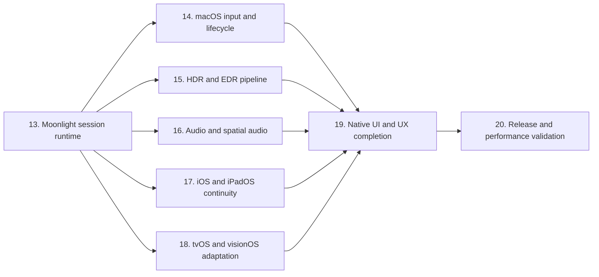

# LuneX 端到端完成路线图

> 当前 App 仍处于 fail-closed 状态。已有类型、策略、编译通过或单元测试通过，不等同于真实 Moonlight 工作流完成。

## 完成口径

任何功能只有同时满足以下条件才可标记完成：

1. 已接入生产 App 运行路径，而不是只有独立类型或测试 stub。
2. 在真实 session 生命周期中工作，并能正确取消和释放资源。
3. 有确定性单元/fixture 测试。
4. 有目标 Apple 平台的运行证据。
5. 涉及 Sunshine 互操作时，有显式授权的 live-host 端到端证据。
6. 构建通过、首次帧出现或策略 resolver 返回预期值都不能单独作为完成证明。

## 依赖顺序

```mermaid
flowchart LR
    R["13. Moonlight session runtime"] --> M["14. macOS input and lifecycle"]
    R --> H["15. HDR and EDR pipeline"]
    R --> A["16. Audio and spatial audio"]
    R --> C["17. iOS and iPadOS continuity"]
    R --> T["18. tvOS and visionOS adaptation"]
    M --> U["19. Native UI and UX completion"]
    H --> U
    A --> U
    C --> U
    T --> U
    U --> V["20. Release and performance validation"]
```

## 当前执行状态（2026-07-30）

| 阶段 | 状态 | 已证明 | 尚未证明/阻塞条件 |
|---|---|---|---|
| 13 | `in_progress`，OpenSpec `54/61` | identity、pairing/RTSP/control协议实现，video/audio处理管线，remote input runtime，统一session ownership，离线fixture、五平台Debug/Release、ASan/TSan/resource gates | production仍缺video/audio network receiver；指定Sunshine版本清单、live pairing、持续视频、可听同步音频、host实际接收输入/feedback和完整E2E均无授权证据 |
| 14 | `in_progress`，OpenSpec `28/29` | 完成AppKit合同、共享坐标、闭合directive、generation-scoped lifecycle、AppModel/media application、active input coordinator、actual direct/relative capture、balanced cursor ownership、responder/dismantle、stream-view backing/display/live-resize检测、privacy-bounded diagnostics、application/normal/五平台Debug+Release、strict/generator/analyzer/sanitizer/resource及simulator独立门 | 授权Sunshine与鼠标/多显示器硬件证明尚未完成 |
| 15 | `in_progress`，OpenSpec `32/33` | color/luminance、decoded/Metal frame、shader/readback、surface/display/resolver/presenter、macOS transition矩阵、四平台typed capability/fallback、5.1–5.5 integration、6.1–6.4验证及6.6跟踪封版完成 | 唯一剩余6.5：授权Sunshine、live compositor与物理HDR/SDR显示器证据 |
| 16 | `in_progress`，OpenSpec `34/35` | canonical布局、真实environment graph/fallback、平台route/entitlement策略、runtime recovery、generation-owned processor/media/AppModel接线、实际状态UI、normal/十配置build、strict/API/analyzer、ASan/TSan/malloc、simulator、合同和阶段自验完成 | 唯一剩余6.6尚无signed provisioning、AirPods、built-in/wired/HDMI、route transition、可听声道/同步和live Sunshine物理证据 |
| 17 | `in_progress`，OpenSpec `35/36` | actual UIKit scene/window/geometry/input、actual-window mobile EDR、sample-buffer PiP runtime、actual-state continuity policy、serialized mobile media owner、media environment/AppModel application与bounded diagnostics、stop/failure/replacement清理、iPhone/iPad单值`audio`配置、UI/回归、normal/build/repository/analyzer/sanitizer/resource/fixed-simulator，以及6.7合同/证明边界封版均已完成 | 唯一剩余6.6 signed/physical PiP/background/Stage Manager/EDR/live Sunshine验收；固定ENet保留4项已归属analyzer finding |
| 18 | `in_progress`，OpenSpec `45/50 ready` | 1.1–8.3已完成task级离线验收；8.3 strict/fixture/generator/membership/clean-room/license/entitlement/configuration/privacy/API/repository门通过，fresh Debug/Release Analyze均为`0 error/0 compiler warning/4 identical fixed ENet findings`且first-party为0 | next 8.4；8.4-8.8、Simulator runtime、signed/物理/live HDR/audio/input及性能功耗证据未完成 |
| 19 | `pending` | 原生SwiftUI host/app/settings/diagnostics基础界面可构建 | 尚无完整stream controls、恢复UX、多窗口、VoiceOver与键盘/触控任务回归 |
| 20 | `pending` | Release配置与sanitizer静态门禁可执行 | 尚无签名发布包、端到端延迟、功耗、热状态、弱网、内存基线与长时真机证据 |

阶段 14–20 的确定性实现和离线测试可以在阶段 13 的 live gate 等待期间推进，但不得因此把依赖真实host、显示器、音频route、移动设备或签名账户的完成证明标记为通过。阶段 13 保持 `in_progress`，直到 `1.1`、`3.7`、`5.8`、`6.7`、`7.7`、`9.2`、`9.3` 全部取得授权证据。

## 实施阶段

| 阶段 | OpenSpec change | 主要交付 | 开始条件 | 完成证明 |
|---|---|---|---|---|
| 13 | `implement-moonlight-session-runtime` | 原生 identity/pairing、RTSP/control、视频、音频、输入 transport | 当前即可开始 | 配对、持续视频、同步音频、输入、重连、停止全链路 |
| 14 | `integrate-macos-native-input-lifecycle` | `NSEvent`、cursor hide/capture、相对鼠标、焦点释放、decoder/renderer 后台节流 | 阶段 13 输入与媒体通道可用 | key/occlusion/screen/resize 在真实 stream 中生效 |
| 15 | `implement-native-hdr-edr-pipeline` | 10-bit decode、BT.2020/PQ、MDCV/CLL、EDR metadata、tone mapping | 阶段 13 能保留 HDR metadata | HDR/SDR 显示器、headroom 变化、窗口换屏实测 |
| 16 | `integrate-spatial-audio-runtime` | Opus/PCM graph、route detection、environment node、head tracking entitlement | 阶段 13 音频稳定 | 兼容 AirPods/扬声器 route 实测和无权限降级 |
| 17 | `integrate-mobile-scene-pip-continuity` | scenePhase、iPad resize、Stage Manager、PiP、后台 audio、移动 EDR | 阶段 13 session 可暂停/恢复 | iPhone/iPad 真机前后台、PiP、窗口 resize 证据 |
| 18 | `integrate-tvos-visionos-runtime` | tvOS remote/focus、平台 HDR 策略、visionOS window/audio/input | 阶段 13 核心 provider 平台化 | 离线/unsigned/simulator分层验收和授权signed physical Apple TV/Vision Pro工作流 |
| 19 | `complete-native-product-workflows` | pairing/错误恢复、stream controls、overlay、设置、辅助功能和多窗口 UX | 阶段 14–18 的能力稳定 | 关键任务可达性、VoiceOver、键盘和窗口回归 |
| 20 | `validate-release-performance-quality` | 延迟、功耗、内存、热状态、弱网、长时运行、Release signing | 阶段 19 完成 | 真机测量、无泄漏、长时稳定和发布构建 |

## 阶段 14：macOS 原生输入与生命周期

- `docs/runtime/macos-input-lifecycle-contract.md`是AppKit输入、键码翻译、cursor平衡、坐标revision和多窗口generation所有权的实现合同；`NSEvent.keyCode`禁止直接写入远端wire。
- `StreamCoordinateSnapshotPublisher`只在source/drawable/mode变化时递增revision，无效geometry或revision溢出清空snapshot；`StreamVideoRectangleResolver`统一产出fit letterbox与fill source crop。`StreamMetalPresenter`与`InputMapper`现消费同一个immutable snapshot，texture尺寸与snapshot不一致时只清屏，fit黑边输入直接拒绝。
- 把 `AppKitLifecycleMonitor` 输出同时接入 renderer、decoder、frame queue 和 input capture。
- occluded/minimized 时停止 drawable acquisition 和帧提交，降低或暂停解码，但保持可恢复的 session/control 状态。
- `didBecomeKey` 后按用户设置启用远程鼠标；`didResignKey` 立即显示系统鼠标并发送 held key/button release。
- 使用真实 `NSEvent` 采集键盘、相对/绝对鼠标、滚轮和按钮。
- 换屏、backing scale 和 resize 后，以实际 decoded source size 与 drawable video rect 更新统一 `RenderTransform`。
- lifecycle application只在generation/revision reservation仍有效且processor effect成功后发布；相同pending application共享一个effect，更高revision、stop和同UUID replacement均能阻止悬挂旧effect回写。
- `ApplicationInputSink`只接受typed event；AppModel在media owner启动时内部固定generation，environment在provider调用前再次验证session、generation与input readiness，调用方不能伪造或沿用replacement generation。
- `MacSessionInputCoordinator`以同步main-actor admission接收冻结的platform sample与coordinate/cursor/shortcut策略；固定容量环形FIFO将in-flight计入backpressure，每个generation仅一个consumer按序调用application sink，旧token不能进入replacement。
- focus loss同步关闭新sample admission但不停止accepted FIFO drain；同代只执行一个generation-scoped `releaseAll` barrier，回焦必须等屏障成功，旧release在provider suspension前后均不能越过replacement ownership fence。
- send/input-channel failure、stop、remote termination、detach与replacement共享terminal path；它关闭admission、丢弃未开始sample、一次cleanup并等待当前delivery/release，async activation及其并发调用不能跨代遗留consumer。
- `MacCursorCaptureOwner`只逆转自身成功取得的状态：relative capture先成功解除pointer association再隐藏cursor，重复apply/release幂等；association恢复失败时仍立即unhide，并保留association ownership供后续cleanup重试。实际surface通过共享lease broker调用`NSCursor.hide/unhide`与`CGAssociateMouseAndMouseCursorPosition`；replacement先取得lease后，旧dismantle不能恢复新surface的cursor ownership。
- `MacStreamInputCaptureView`是macOS-only flipped first responder，直接override key/flags/key-equivalent事件并同步产出值样本；左右modifier独立跟踪，repeat不伪造key-up，reserved shortcut分类跨key-up保留，Escape始终本地并触发一次capture-exit callback。`MacVirtualKeyTranslator`只输出明确的Win32 VK映射，未知或语义不确定的macOS key fail closed。
- `MacStreamInputCaptureView`现直接继承`MTKView`并成为SwiftUI实际Metal stream surface；surface attachment owner跟随真实window attach/detach，清理callback、transient input、Metal delegate与presentation pause。共享attachment/cursor lease阻止旧coordinator迟到dismantle清除replacement lifecycle或cursor ownership。actual stream-view backing geometry、active-session handler、admission和cursor eligibility均已接入。
- enabled capture在附着或点击actual surface时幂等请求first responder；disabled默认不抢焦点，关闭admission或dismantle只在surface自身持有时释放responder，并清transient tracking。重复dismantle显式关闭admission且不会重放事件或再次清理replacement。
- lifecycle monitor现同时绑定current window与actual Metal surface；drawable从`surface.convertToBacking(surface.bounds)`派生并同步到`MTKView`。surface frame/bounds、window resize/end-live-resize/screen/backing和application screen-parameter变化均重新读取当前screen EDR与surface pixels；旧render coordinate snapshot不再反向覆盖actual drawable。
- AppModel以单一revision-aware pump缓存并应用lifecycle到当前media generation；negotiated decoded source、actual drawable与display headroom形成同一render/input snapshot。input readiness激活generation-owned coordinator，focus loss执行ordered release barrier，stop/reconnect/remote termination/channel failure终止generation，actual surface sample只进入AppModel。session/input readiness/lifecycle/geometry共同决定admission；持久化设置独立选择relative或direct映射与supported shortcut forwarding，Escape只退出relative capture。
- DiagnosticsStore分别保留bounded审计历史与可清理的current action；stream overlay只读取当前stream action，pairing重试/成功清理旧pairing action。macOS lifecycle/input以固定code、无UUID/endpoint/display/坐标/按键payload且按语义状态去重；input generation恢复只清input action，focus/occlusion不误清decoder/audio fatal，stop/disconnect清current stream action但保留历史。provider send/release失败用独立failed gate立即关闭surface admission，同时保留generation token完成后续teardown。

### 阶段 14 当前验收边界

- OpenSpec当前`28/29 in_progress`。任务1.1至6.4与6.6均有确定性实现和离线验收；6.5未执行，因此change不可archive、阶段不可标记`complete`。
- normal macOS suite为`470 total / 469 passed / 1 explicit Keychain skip / 0 failed`；唯一skip是已完成一次授权验证后禁用的真实Keychain round-trip，不存在被禁用后冒充通过的live-host XCTest。
- macOS及固定iPhone/iPad/tvOS/visionOS的Debug/Release十构建零编译诊断；ASan和TSan完整suite各为`469 passed + 1 Keychain skip`且零sanitizer报告，malloc/resource选择集`250/250`。固定ENet analyzer风险仍为两配置一致的4项，仓库自有bridge为0项。
- simulator构建前、构建后和独立读回三份规范化快照逐字节一致；固定四个名称/UUID各唯一、可用且`Shutdown`，全部available simulator的`Booted=0`，未创建或显式启动设备。
- 6.5必须在授权Sunshine版本和测试app上，用物理键盘与鼠标逐项确认key down/up、direct/relative移动、按钮、双轴scroll、focus release、occlusion后台节流与visible resume、连续resize和至少两个不同scale/display的坐标映射；同时关联客户端隐私诊断与host实际receipt。没有该证据时，fixture/fake provider、编译、模拟器、窗口通知单测和本机UI观察都不能替代通过。
- 阶段15至20的确定性实现可继续推进，但不得借后续HDR、音频、移动或产品工作流测试回填6.5，也不得改变阶段13的7项live/hardware未完成状态。
- 独立阶段级离线自验在已推送`3ef99ee`上通过：全新DerivedData完整macOS suite为`470 total / 469 passed / 1 Keychain skip / 0 failed`且日志零诊断，OpenSpec strict `5/5`、project generator hash稳定、固定simulator仍全部`Shutdown`。该自验不改变6.5 pending或阶段`in_progress`状态。

## 阶段 15：HDR 和 EDR

- OpenSpec `implement-native-hdr-edr-pipeline`当前`32/33 in_progress`；1.1至6.4与6.6均有确定性实现和离线验收，唯一剩余6.5为授权Sunshine与物理HDR/SDR显示器证据。change不可archive，阶段不可标记`complete`；阶段16可继续，但其证据不得替代6.5。
- presenter在configuration identity变化时先暂停并清理旧presentation、失效runtime、原子应用resolved surface、创建replacement runtime，再发布新ownership；新surface第一drawable必须先opaque clear。coordinate/backing revision只清理presentation/pipeline cache，不伪装成display revision或更改surface。
- closed结果与stop/replacement会幂等失效runtime、清除resolved ownership并恢复SDR；closed后可按当前render schedule恢复，旧view迟到transition不能修改replacement。unsupported、surface mutation或runtime creation failure均fail closed并撤销presenter ownership。
- 同一presentation合同从resolver的`.requiresApplication`变为`.ready`时只刷新observer/诊断语义，不重新应用surface或创建runtime。4.4确定性验收为focused `25/25`、完整macOS `593 total / 592 passed / 1 explicit Keychain skip / 0 failed`、五平台Debug warnings-as-errors且各自一次Metal compile/link与零结构化诊断。simulator清单前后SHA-256均为`0470edc00aea815358b4bed51fa43b73b79a5cbc61f80856f9630c6128568d41`，固定四实例保持available/`Shutdown`且全局`Booted=0`。
- 4.5用同一macOS组合矩阵验证screen identity与same-display current headroom变化会建立新display revision并替换runtime；旧window的resize/occlusion/resign-key和detach受attachment lease隔离。SDR-on-EDR、HDR-on-SDR typed fallback、HDR-on-EDR、stop恢复SDR与first opaque clear先于matching frame均已覆盖。最终focused `4/4`、扩展`96/96`、完整macOS `597 total / 596 passed / 1 Keychain skip / 0 failed`及五平台Debug Metal build通过。
- 4.6用单一平台capability resolution驱动resolver与surface adapter：macOS/iOS为候选supported；tvOS保留current/potential headroom读取但因surface API不可用进入typed SDR fallback；visionOS因没有current headroom来源进入typed SDR fallback。最终focused `33/33`、完整macOS `599 total / 598 passed / 1 Keychain skip / 0 failed`、五平台Debug build和simulator不变门通过。
- 5.1让media environment转发session/media-generation-owned decoder start/frame/clear事件；presentation source发布单调revision、实际decoded layout和metadata，AppModel拒绝旧session/media/decoder/revision并以真实lifecycle display snapshot/current headroom和user preference解析配置，actual macOS/UIKit surface只在resolved语义变化时执行transition。扩大矩阵`132/132`、完整macOS `604 total / 603 passed / 1 Keychain skip / 0 failed`、五平台Debug warnings-as-errors Metal build和simulator不变门通过。
- settings不再合成`renderState.headroom`，reconnect先进入权威fail-closed snapshot再等待media teardown；5.2的active-session eligibility已完成。5.3提供固定代码/固定摘要、语义去重、仅清`.hdr` action、bounded history与presenter replacement lease。5.4的单一application gate覆盖SDR、HDR EDR、same-display headroom降级/恢复、metadata change、cross-display revision、stale frame与clean stop。5.5把实际presentation状态接入stream overlay和Settings，丢弃platform associated value及所有raw metadata/frame/host/display/revision/headroom payload，提供固定可访问文案，并用`ViewThatFits`避免compact宽度溢出。6.1–6.4的normal、十配置五平台build、综合质量/资源和独立simulator门均完成；6.5–6.6、production compositor EDR signaling、live Sunshine HDR和物理亮度/颜色/跨显示器证据仍未完成，当前离线证据不得描述为端到端HDR显示证明。
- 把 `display supports EDR` 与 `stream is HDR` 拆为两个独立状态。
- 从解码 format description 保留 bit depth、primaries、transfer function、matrix、MDCV 和 CLL。
- 配置 10-bit Metal 输出、目标 colorspace 和 EDR metadata。
- 明确 PQ/reference white 到当前 `maximumExtendedDynamicRangeColorComponentValue` 的映射策略。
- 覆盖 SDR-on-HDR、HDR-on-SDR、EDR headroom 动态变化和窗口跨屏。
- tvOS/visionOS 不复用不可用的 macOS layer API，分别制定受支持输出路径。

### 阶段 15 当前验收边界

- 离线门证明显式BT.2020/PQ到SDR/EDR映射、actual Metal surface transaction、current-headroom/display revision ownership、可访问状态、五平台编译、sanitizer和资源释放；不证明Sunshine实时HDR数据已经到达，也不证明Apple compositor或面板进入目标HDR状态。
- 6.5需要记录授权Sunshine版本、客户端提交、测试app和HDR/SDR参考图来源；host、app、endpoint、显示器序列号和原始frame不得进入普通诊断或公开证据。
- 在HDR物理显示器上分别验证SDR参考白/Rec.709外观、HDR10 EDR激活和高光保留；在SDR显示器上验证typed HDR-to-SDR fallback且无异常亮度、剪裁或偏色。
- 在同一HDR显示器上触发current headroom下降与恢复，关联隐私受限的客户端状态、compositor可观察状态和参考图或测量结果，确认不继续使用旧headroom。
- 在代表性HDR/SDR或不同headroom显示器间移动窗口，验证first opaque clear、无旧revision闪帧、drawable填满窗口且input映射仍正确；再覆盖sleep/wake、display disconnect/reconnect和clean stop后无残留EDR surface ownership。
- 可接受证据为脱敏的测试矩阵、时间戳、系统/客户端状态、参考图截图或色度/亮度测量结果；单元测试、shader readback、设置了`wantsExtendedDynamicRangeContent`、模拟器或肉眼一句“看起来正常”均不能单独勾选6.5。
- 已推送`372ca60`上的独立离线阶段自验通过：全新DerivedData完整macOS suite为`616 total / 615 passed / 1 Keychain skip / 0 failed`且结构化诊断为零，OpenSpec strict `6/6`、generator哈希稳定、四个固定simulator仍`Shutdown`且全局`Booted=0`。该自验不改变6.5 pending或阶段`in_progress`状态。

## 阶段 16：空间音频

- `docs/runtime/spatial-audio-contract.md`是canonical PCM、environment graph、平台route/entitlement、recovery/generation、实际UI/diagnostic和物理验收的权威合同。
- OpenSpec `integrate-spatial-audio-runtime`当前`34/35 in_progress`。1.1至3.6完成canonical mono/stereo/WAVE 5.1/7.1、显式interleaved Int16/Core Audio布局、session-owned `player -> environment -> mixer` graph、typed direct fallback、macOS/iOS/tvOS listener、visionOS intended-experience、embedded entitlement、移动audio-session、macOS actual-output capability及有界route/observer矩阵。
- 4.1至4.6把route/policy/interruption/media-services rebuild串行化，以graph generation隔离schedule与late completion；processor、media environment和AppModel只接收当前session/media generation，preference、replacement、failure、reconnect与clean stop均有application gate。
- 5.1至5.5完成向后兼容设置、privacy-bounded typed diagnostics、audio action ownership、actual-runtime stream overlay/Settings，以及compact/wide、localization和accessibility矩阵；desired preference不再伪造actual head-tracked状态。
- 6.1 normal为`721 total / 720 passed / 1 explicit Keychain skip / 0 failed`。6.2的macOS与固定iPhone/iPad/tvOS/visionOS Debug/Release共10个build全部零structured diagnostics；6.3 strict `7/7`、generator/fixture/dependency/entitlement、四SDK C/API和analyzer门通过。
- 6.4完整ASan/TSan各`721/720/1/0`且零sanitizer report；11类malloc/resource集合`185/185`，覆盖graph replacement、observer cancellation和scheduled-buffer release/late completion。6.5的6.2 before/after/current三份simulator快照SHA-256均为`5d39940efaf4b37d2592952a96973621dda435f7a92cf2d43d911ea5df48140a`，固定四实例各唯一、available、`Shutdown`且全局`Booted=0`。
- 6.7新增权威空间音频合同并同步路线图、signed entitlement/hardware instructions和proof boundary；阶段级fresh normal再次通过`721/720/1/0`，strict `7/7`、generator、ASan/TSan/resource与simulator证据组合读回通过。

### 阶段 16 当前验收边界

- 已完成的离线门证明production ownership、确定性route/recovery、实际状态UI、SDK编译、静态边界、sanitizer/resource和simulator identity；不证明Apple签名/profile允许head-pose entitlement，也不证明AirPods或物理输出实际按预期工作。
- 6.6必须在授权signed candidate和物理设备上覆盖entitlement granted/missing、AirPods head tracking开关、fixed/nonspatial fallback、built-in speaker、wired/USB/HDMI 5.1/7.1逐声道识别、route transition、interruption/media reset、live Sunshine音画同步和clean teardown。
- 物理收据必须关联OS/Xcode、client commit、签名configuration、脱敏Sunshine版本、negotiated layout、route类别、desired/actual状态、操作/预期/实际和teardown；不得保存secret、endpoint、profile UUID、证书/设备序列号或原始音频。
- 当前没有6.6授权收据，任务保持pending。change为`34/35 in_progress`，不可archive、阶段不可标记`complete`；阶段17至20可以继续，但其证据不得回填6.6。

## 阶段 17：iOS/iPadOS 连续性

- `docs/runtime/mobile-scene-pip-continuity-contract.md`是actual UIKit stream view/window/screen、共享geometry/input、sample-buffer PiP、合法background continuity、mobile EDR和物理验收的权威合同。
- OpenSpec `integrate-mobile-scene-pip-continuity`当前`35/36 in_progress`；1.x至5.6、6.1–6.5及6.7均已完成。完整normal与完整ASan/TSan均为`909/908/1/0`且唯一skip是显式真实Keychain用例；十配置build、repository/API/analyzer、resource和fixed-simulator门通过。6.7已同步权威合同、路线图、OpenSpec与三份规划，并固定contract/static、build、simulator、signed artifact、physical/live五级证明边界。唯一剩余6.6为signed physical acceptance；当前证据仍不证明system PiP、background duration、Stage Manager、visible EDR或live Sunshine。
- RootView 接入 `scenePhase`、实际 `UIWindowScene`、screen、scale 和几何变化。
- iPad Stage Manager 与多窗口 resize 实时更新 drawable、input transform 和 decoder output policy。
- 使用 `AVPictureInPictureController` 和有效 content source 实现真实 PiP。
- 后台只在 audio/PiP 合法路径下保活；无合法路径时明确暂停或断开。
- 从实际 `UIScreen.currentEDRHeadroom` 更新移动 render state。
- 真机验证锁屏、来电/音频中断、前后台、PiP、外接屏和窗口恢复。

### 阶段 17 当前验收边界

- 已完成合同/静态、unsigned build、deterministic normal/analyzer/sanitizer/resource与fixed simulator identity/build层；这些层级不能提升为signed artifact或physical/live证明。
- 6.6必须关联LuneX commit、OS/Xcode、device class、签名配置类别、脱敏Sunshine版本、场景、预期/实际、bounded runtime state和clean teardown；不得记录endpoint、secret、profile UUID、证书、设备序列号、raw scene/display identity或媒体payload。
- 授权iPhone/iPad矩阵必须覆盖system PiP possible/start/active/stop/restore/failure、前后台/锁屏/中断/route或media reset、audio-only/PiP合法连续性及最后路径丢失、iPad Stage Manager resize/rotation、external-display drawable/input、SDR/HDR-to-SDR/mobile EDR、空间音频共存、live Sunshine、CPU/GPU/memory/power/thermal与无残留teardown。
- 当前没有6.6 signed physical receipt，change不可archive、阶段不可标记`complete`。阶段18–20可以继续，但其编译、simulator或离线测试不得回填6.6。
- 已推送`c7c9089`上的独立阶段级离线自验通过：fresh macOS normal `/tmp/LuneX-17-stage-acceptance.xnt9je`为`909/908/1 exact Keychain skip/0`且结构化诊断为0，组合门`/tmp/LuneX-17-stage-acceptance-final.k8BdmF`通过strict `8/8`、generator、`35/36 only 6.6 pending`、Git parity与fixed simulator no-launch/no-mutation读回；不改变6.6 pending。

## 阶段 18：tvOS/visionOS 运行适配

- `docs/runtime/tvos-visionos-runtime-contract.md`是阶段18 target/config、actual ownership、public API、simulator identity、clean-room和physical/live proof boundary的权威合同。
- OpenSpec `integrate-tvos-visionos-runtime`当前为`23/50 ready`、next 4.5；4.4复用唯一AVAudioSession notification source与canonical AVAudioEngine graph，将actual route counts/support、entitlement、listener head-tracking readback、runtime stage/cause、interruption、media loss/reset和graph generation规范化后应用到current tvOS presentation ownership；replacement回放latest valid route，invalid runtime/action failure/revision exhaustion进入typed terminal且清空audio route。repository pre-gate `/tmp/LuneX-18-4_4-repository-pre-r3.FrvzgU`通过后4.4已勾选；下一项为4.5 shared generation teardown/reconnect replay。
- 勾选后的只读final-state `/tmp/LuneX-18-4_4-final-state.gObCd6`确认strict `9/9`、`23/50 next 4.5`、4.4 done、稳定project SHA-256、精确19文件scope、五份权威记录、全部retained evidence及opt-in/process/reference/diff边界；未重复test、build、generator或Simulator操作。
- 4.4 fresh evidence为publisher `27/27`、environment `3/3`、AppModel `2/2`、focused `248/248`、related `332/332`、normal `1054/1053/1 exact Keychain skip/0`；fixed Apple TV direct与macOS/fixed iPhone/iPad/Apple TV/Vision Pro unsigned Debug均结构化diagnostics为0且各有`1 AIR/1 metallib`。两个真实opt-in保持unset，固定UUID只作build destination，未执行Simulator lifecycle。
- OpenSpec当前为`24/50 ready`、next 4.6。4.5使同一actual view跨media reconnect时按geometry后display顺序重放current value且不推进semantic revision，AppModel只向replacement media generation应用`activate/scene/input/display`；latest audio仍由唯一native environment/publisher重放。remote termination与local stop竞态收敛为一次terminal snapshot、一次coordinator teardown和五项资源各一次stop，不创建第二surface owner、display observer、decoder或audio graph。
- 4.5 fresh evidence为current replay `2/2`、AppModel reconnect `1/1`、remote/local teardown race `1/1`、focused `248/248`、related `474/474`、normal `1055/1054/1 exact Keychain skip/0`；fixed Apple TV direct与macOS/fixed iPhone/iPad/Apple TV/Vision Pro unsigned Debug均结构化diagnostics为0且各有`1 AIR/1 metallib`。repository pre-gate `/tmp/LuneX-18-4_5-repository-pre.4s9qBy`通过后4.5已勾选；下一项4.6补齐tvOS媒体回归矩阵。
- 勾选后的只读final-state `/tmp/LuneX-18-4_5-final-state.5ZgeJt`确认strict `9/9`、`24/50 next 4.6`、4.5 done、稳定project SHA-256、精确14文件scope、最终权威记录、全部retained evidence及opt-in/process/reference/diff边界；未重复test、build、generator或Simulator操作。
- post-record `/tmp/LuneX-18-4_5-post-record.5B9rw1`与最终审计 `/tmp/LuneX-18-4_5-final-audit.ASK927`确认14文件authority scope、2个production/4个test文件、replay identity/revision/order、replacement terminal/resource teardown、无第二runtime/裸`try?`/隐私sink、proof boundary和retained evidence均通过；4.5可独立提交推送。
- 4.6不增加production路径；一条coordinator综合序列覆盖invalid-headroom HDR-to-SDR、current frame、geometry重交、direct EDR、old decoder stale frame、interruption、media loss、graph generation 2 reset/recovery和一次clean stop，既有AppModel workflow补充current/replacement HDR与spatial actual state及reconnect/termination clearing断言。
- 4.6 fresh evidence为matrix `1/1`、cross-layer `2/2`、focused `249/249`、related `474/474`、normal `1056/1055/1 exact Keychain skip/0`；fixed Apple TV direct与macOS/fixed iPhone/iPad/Apple TV/Vision Pro unsigned Debug均结构化diagnostics为0且各有`1 AIR/1 metallib`。repository pre-gate `/tmp/LuneX-18-4_6-repository-pre.jpqOgA`完整通过pre-mark `24/50 next 4.6`、strict `9/9`、稳定generator、精确9文件scope和全部retained evidence后4.6已勾选；OpenSpec为`25/50 ready`、next 5.1。
- 勾选后的只读final-state `/tmp/LuneX-18-4_6-final-state-r2.0Oe6dd`确认strict `9/9`、`25/50 next 5.1`、4.6 done、稳定project SHA-256、精确10文件scope、production/project graph零diff、全部retained evidence、唯一Keychain skip及opt-in/process/reference/diff边界；未重复test、build、generator或Simulator操作。
- post-record `/tmp/LuneX-18-4_6-post-record.4dFTZB`与final audit `/tmp/LuneX-18-4_6-final-audit.mNUBR2`确认相同10文件scope、两份test与八份authority、helper默认兼容、组合矩阵/public actual-state语义、无异步XCTest autoclosure、无production/project graph变化、无合同删除及全部proof boundary；4.6可独立提交推送。
- OpenSpec当前为pre-mark `25/50 ready`、next 5.1。5.1复用actual `TVVisionStreamMetalView`与唯一surface generation/geometry owner，增加弱window/scene identity、八类公开UIWindow/UIScene notification、同scene replacement token更换和observation UUID late-event拒绝；visionOS focus eligibility来自visible+interactive+current key window，tvOS继续使用focus engine语义，不创建第二surface/runtime或提前实现5.2/5.3/6.x。
- 5.1 fresh evidence为minimal `2/2`、focused `219/219`、related `121/121`、normal `1058/1057/1 exact Keychain skip/0`；fixed Vision Pro和fixed Apple TV direct、以及macOS/fixed iPhone/iPad/Apple TV/Vision Pro unsigned Debug全部结构化diagnostics为0且各有`1 AIR/1 metallib`。真实opt-in均unset，固定UUID只作build destination，未执行Simulator lifecycle；这些证据不证明物理Vision Pro focus/resize/input、HDR、空间音频、live Sunshine、comfort或性能功耗。
- 5.1 repository pre-gate `/tmp/LuneX-18-5_1-repository-pre.v1iwKK`完整通过pre-mark `25/50 next 5.1`、strict `9/9`、三次稳定generator、精确10文件scope、observer/generation/owner语义与全部retained evidence后已勾选；预期OpenSpec为`26/50 ready`、next 5.2，等待只读post-mark final-state确认。
- 勾选后的只读final-state `/tmp/LuneX-18-5_1-final-state.BQG3yQ`确认strict `9/9`、`26/50 ready`、5.1 done、next 5.2、稳定project SHA-256、精确11文件scope、全部retained evidence、唯一Keychain skip及opt-in/process/reference/dependency/diff边界；未重复test、build、generator或Simulator操作。
- post-record `/tmp/LuneX-18-5_1-post-record-r3.jAEfZ5`与final audit `/tmp/LuneX-18-5_1-final-audit.U5fWgQ`确认11文件scope、1个production/2个test/8个authority文件、generation/weak identity/token replacement/observation UUID/platform focus/single geometry writer、无越界input/media runtime、无删除合同及全部proof boundary；5.1可独立提交推送。
- OpenSpec当前为pre-mark `26/50 ready`、next 5.2。5.2复用2.3唯一`TVVisionUIKitStreamGeometryBindingOwner`与`MobileStreamSurfaceCoordinator`：actual SwiftUI先同步source/mode，再发布exact coordinate snapshot；Metal fit/fill与`TVVisionStreamAbsoluteInputMapping`共享同一semantic revision、resolved video rectangle/source crop和input reference。detach、coordinate unavailable或invalid geometry共同清除drawable、render coordinate与mapping，不增加第二production mapper；5.3仍负责实际keyboard/pointer/indirect/controller adapter及current-generation admission。
- 5.2 fresh综合用例 `/tmp/LuneX-18-5_2-minimal-r3.luBq4W`为`1/1`，presenter/focused/related分别为`71/71`、`220/220`、`121/121`，normal为`1059/1058/1/0`且唯一skip仍是显式真实Keychain测试；fixed Vision Pro direct `/tmp/LuneX-18-5_2-visionos.ags3s2`与五平台unsigned Debug `/tmp/LuneX-18-5_2-builds.gqJzlP`全部零结构化诊断并各有`1 AIR/1 metallib`。这些只证明离线mapping语义与unsigned SDK兼容，不证明simulator/物理Vision Pro输入、HDR、空间音频、live Sunshine、性能功耗或温度。
- 5.2 repository pre-gate `/tmp/LuneX-18-5_2-repository-pre-r2.Jwvbum`完整通过fixture self/tree、strict `9/9`、pre-mark `26/50 next 5.2`、三次稳定generator、精确8文件test/authority scope、零production diff、综合geometry/render/input close语义、全部retained evidence、唯一Keychain skip及reference/dependency/opt-in/process/diff边界；现可勾选5.2并以只读post-mark确认`27/50 next 5.3`。
- 勾选后的只读final-state `/tmp/LuneX-18-5_2-final-state-r2.0VX1j5`确认strict `9/9`、`27/50 ready`、5.2 done、next 5.3、稳定project SHA-256、精确9文件scope、零production/reference/dependency diff、全部retained evidence、唯一Keychain skip及disabled opt-in/no-process/diff边界；未重复test、build、generator、Keychain或Simulator操作。
- post-record `/tmp/LuneX-18-5_2-post-record-r2.d3bpX7`与final audit `/tmp/LuneX-18-5_2-final-audit.YC6Bfa`确认9文件scope为1 test/8 authority/0 production，actual render-mode-before-geometry顺序、fit/fill shared revision、detach/invalid共同关闭、唯一tasks checkbox替换、无第二mapper/project/dependency/reference变化及全部proof boundary；没有阻止独立提交的问题。
- OpenSpec当前为pre-mark `27/50 ready`、next 5.3。5.3候选实现以XROS 26.4 public API接入`UIPress.key`、key-window first responder、`.indirectPointer` hover/scroll与既有GameController owner；纯adapter产生canonical keyboard/absolute pointer/button/scroll事件，AppModel在捕获和实际发送前复核current presentation/surface/input generation、capability和focus。controller lease按平台进入共享complete roster/motion/feedback registry，host-visible routed roster保持串行差异；tvOS-only release-plan guard未放宽。
- 5.3 fresh evidence为adapter/controller `21/21`、最终focused `23/23`、routing fix `2/2`、related `100/100`、normal `1065/1064/1 exact Keychain skip/0`；fixed Vision Pro direct `/tmp/LuneX-18-5_3-visionos-direct.kJobJV`与五平台unsigned Debug `/tmp/LuneX-18-5_3-builds.BSj3P1`全部结构化diagnostics为0且各有`1 AIR/1 metallib`。真实opt-in均unset，固定UUID只作build destination且未执行Simulator lifecycle。
- 5.3不完成5.4 system gesture/recenter/capture/safety/volume/escape/gaze/hand全量本地保留，也不完成5.5 ordered held-state release/local UI restoration；离线和unsigned build不证明Simulator runtime、signed/物理Vision Pro输入、HDR、空间音频、live Sunshine、延迟、comfort、性能、功耗或温度。
- 5.3 repository pre-gate `/tmp/LuneX-18-5_3-repository-pre-r3.K2qbMj`完整通过fixture self/tree、strict `9/9`、pre-mark `27/50 next 5.3`、三次稳定generator、精确17文件scope、current source/test/docs语义、全部retained evidence和privacy/reference/dependency/opt-in/process/diff边界；5.3现已勾选，预期OpenSpec为`28/50 ready`、next 5.4。
- 勾选后的只读final-state `/tmp/LuneX-18-5_3-final-state.bsTiTn`确认`28/50 ready`、5.3 done、next 5.4与精确18文件scope；未重复test/build/generator、访问Keychain或操作Simulator lifecycle。
- post-record `/tmp/LuneX-18-5_3-post-record-r3.HJheG4`确认相同OpenSpec状态与18文件scope、稳定project hash、五份authority、retained test/build/Metal、唯一Keychain skip、disabled opt-ins、no-process及dependency/reference/diff边界；5.3进入最终diff审计。
- final audit `/tmp/LuneX-18-5_3-final-audit.TNi2hb`确认public事件源、first-responder/teardown、双重admission、host-visible controller routing、tvOS-only release guard、测试/project membership、5.4/5.5 pending和仓库边界；无阻止5.3独立提交的问题。
- OpenSpec当前为pre-mark `28/50 ready`、next 5.4。5.4复用1.4 typed system-interaction decision，只把actual `UIPress.key`可观察的Escape、keyboard mute/volume、Print Screen、Command-Shift-3/4/5 capture与Command-Q/H/Tab映射为current-surface local state且零Moonlight event；Digital Crown/recenter/safety/system-owned capture/volume及gaze/hand无应用事件源，未增加ARKit/direct/spatial recognizer，既有pointer recognizer仍只允许`.indirectPointer`。
- 5.4 fresh focused/related分别为`24/24`与`101/101`，normal为`1066/1065/1 exact Keychain skip/0`；fixed Vision Pro direct `/tmp/LuneX-18-5_4-visionos-direct.CsJwFj`及五平台unsigned Debug `/tmp/LuneX-18-5_4-builds.pGfMJ3`全部零结构化diagnostics并各有`1 AIR/1 metallib`。固定UUID仅作build destination且未操作Simulator lifecycle。
- 5.4不完成5.5 ordered held-state release/local UI restoration；当前证据不证明Simulator runtime、signed/物理Vision Pro recenter/capture/volume/safety或gaze/hand行为、live Sunshine、延迟、comfort、性能、功耗或温度。repository pre-gate通过前保持未勾选。
- 5.4 repository pre-gate `/tmp/LuneX-18-5_4-repository-pre.sSXJDF`完整通过fixture self/tree、strict `9/9`、pre-mark `28/50 next 5.4`、三次稳定generator、精确13文件scope、canonical local reservation/current-surface ownership/无synthetic source语义、全部retained test/build/Metal、唯一Keychain skip及privacy/reference/dependency/opt-in/process/diff边界；5.4已勾选。
- 勾选后的只读final-state `/tmp/LuneX-18-5_4-final-state.GcQmvO`确认OpenSpec `29/50 ready`、5.4 done、next 5.5、稳定project SHA-256与精确14文件scope；未重复generator/test/build、访问Keychain或操作Simulator lifecycle。5.5仍负责ordered held-state release与local UI restoration。
- post-record `/tmp/LuneX-18-5_4-post-record.7WByk7`与final audit `/tmp/LuneX-18-5_4-final-audit.CbmtKb`确认五份authority均含双门证据索引，14文件精确分类为4 production/2 test/8 authority，tasks只有5.4 checkbox替换，public key/current surface/零remote event/indirect-pointer-only/tvOS不变/5.5 pending及仓库边界均成立；无阻止独立提交的问题。
- OpenSpec当前为pre-mark `29/50 ready`、next 5.5。5.5以一条main-actor reconciliation链把focus/scene/input readiness/surface replacement/provider failure/remote termination/stop映射到1.4 canonical effects：同步关闭admission，等待keyboard/pointer FIFO及controller roster/motion，执行一次held release，再恢复bounded local ownership；terminal latch拒绝late geometry。actual visionOS surface在capture关闭时清active key/button、resign first responder并移除indirect recognizer，current eligible generation才幂等恢复。
- 共享`MacSessionInputCoordinator.terminate`保留默认release barrier；仅当tvOS/visionOS平台ordered barrier已完成或已单次尝试时由AppModel显式跳过第二barrier，仍drain in-flight、drop queue、关闭generation/capture且cleanup一次。暂停后审计修复了内部合同构造fallback的drain/release顺序，并让held release provider失败terminal-latch为`inputUnavailable`且拒绝late geometry。fresh focused `/tmp/LuneX-18-5_5-audit-focused.7SdLvE`为`42/42`，related `/tmp/LuneX-18-5_5-audit-related.hmvlgf`为`189/189`，normal `/tmp/LuneX-18-5_5-audit-normal.4HpgIt`为`1069/1068/1 exact Keychain skip/0`；五平台 `/tmp/LuneX-18-5_5-audit-builds.ccZsdc`均零结构化diagnostics且各有`1 AIR/1 metallib`。5.5在repository pre-gate前保持未勾选，5.6及physical/live证明仍pending。
- fresh repository pre-gate `/tmp/LuneX-18-5_5-repository-pre-r3.GP0fhH`完整通过fixture self/tree、strict `9/9`、pre-mark `29/50 next 5.5`、三次稳定project SHA-256、精确13文件scope、membership/release语义、全部post-audit retained evidence、唯一Keychain skip及privacy/clean-room/reference/dependency/opt-in/process/diff边界；5.5现已勾选。5.6及6.x–8.x、signed/physical/live证明继续pending。
- 勾选后的只读final-state `/tmp/LuneX-18-5_5-final-state.QP2qUU`确认strict `9/9`、OpenSpec `30/50 ready`、5.5 done、next 5.6、精确14文件scope、唯一5.5 checkbox替换、全部retained evidence、disabled opt-ins、无test进程及reference/dependency/diff边界；未重复test、build、generator、Keychain或Simulator操作。
- post-record `/tmp/LuneX-18-5_5-post-record.xbp4eR`与final audit `/tmp/LuneX-18-5_5-final-audit.7fk9HU`确认五份authority索引、14文件4 production/2 test/8 authority分类、唯一5.5 checkbox替换、typed effect顺序、release-failure terminal latch、共享coordinator无第二barrier、surface capture撤销恢复及5.6 pending边界；无阻止5.5独立提交的问题。
- OpenSpec当前为`31/50 ready`、next 6.1。5.6不改production，新增三条连接矩阵：AppModel证明same-generation连续resize/fit-fill保持capture与held state、reserved interaction本地、replacement和terminal各一次release；surface证明foreign window/scene过滤、geometry/mapping同revision、stale generation拒绝及detach/invalidate后inert；value合同证明全capability admission、unsupported拒绝、absolute pointer mapping、reserved disposition和ordered idempotent teardown。
- 5.6 fresh focused `/tmp/LuneX-18-5_6-focused-r2.Es1RDS`为`3/3`，related `/tmp/LuneX-18-5_6-related.yIYDyZ`为`213/213`，normal `/tmp/LuneX-18-5_6-normal.4E7C3M`为`1072/1071/1 exact Keychain skip/0`；五平台 `/tmp/LuneX-18-5_6-builds.ijxOfl`均零结构化diagnostics且各有`1 AIR/1 metallib`。repository pre-gate `/tmp/LuneX-18-5_6-repository-pre-r3.FltJEs`与只读final-state `/tmp/LuneX-18-5_6-final-state-r2.ZtO9JF`均通过，确认5.6已勾选、`31/50 next 6.1`及精确11文件scope。固定UUID仅作destination，未查询或操作Simulator lifecycle；6.x–8.x及physical/live证明仍pending。
- post-record `/tmp/LuneX-18-5_6-post-record-r2.omtl07`与final audit `/tmp/LuneX-18-5_6-final-audit.cNq2is`确认五份authority双门索引、11文件3 test/8 authority分类、三条连接矩阵无弱化/禁用测试、唯一5.6 checkbox、production/reference/dependency零diff及proof boundary；无阻止5.6独立提交的问题。
- 6.1复用1.4的checked value合同，由current attached visionOS scene在共享coordinator snapshot中派生唯一`.windowed` actual state，包含immersive/passthrough/stereoscopic/volumetric全量typed unavailable；input/display/audio/video推进时按同一coordinator revision重标，replacement activation、stale ownership、detach和terminal fail closed，tvOS恒为nil，AppModel只投影current session/media/presentation ownership。未创建`ImmersiveSpace`、第二decoder/frame queue或7.x UI。
- 审计后fresh focused `/tmp/LuneX-18-6_1-audit-focused.u9HXzp`为`1/1`，related `/tmp/LuneX-18-6_1-audit-related.3Whib6`为`251/251`，normal `/tmp/LuneX-18-6_1-audit-normal.VXSI3H`为`1074/1073/1 exact Keychain skip/0`；五平台 `/tmp/LuneX-18-6_1-builds.APF2yT`均零结构化diagnostics且各有`1 AIR/1 metallib`。repository pre-gate `/tmp/LuneX-18-6_1-repository-pre-r2.nZ4iKX`与post-mark final-state `/tmp/LuneX-18-6_1-final-state.D3kVOH`通过，确认6.1已勾选、`32/50 next 6.2`及精确scope；固定UUID只作destination且未操作Simulator lifecycle。
- post-record `/tmp/LuneX-18-6_1-post-record-r2.aMya2c`与final diff audit `/tmp/LuneX-18-6_1-final-audit-r2.nVb6kC`确认12文件精确分为`2 production / 2 test / 8 authority`，五份authority证据索引完整，没有测试弱化、并行visionOS媒体owner、6.2提前实现、第二checkbox或privacy/reference/dependency漂移；6.1可独立提交。
- 6.2复用task 4.1单decoder/frame source/coordinator/owner/presenter/actual window surface，连接visionOS frame、geometry revision、surface与ownership replacement、clear/resume、stale rejection和stop。审计发现每笔source delivery各建一个unstructured `Task`可能乱序且无界，现改为ownership-scoped、可取消、64-pending、单consumer FIFO；overflow通过同一consumer只使matching current video component typed failure，old pump无法影响replacement。
- post-audit focused `/tmp/LuneX-18-6_2-audit-focused-r4.vj6AKw`为`4/4`，related `/tmp/LuneX-18-6_2-audit-related.xqXKjd`为`255/255`，normal `/tmp/LuneX-18-6_2-audit-normal.rwmq84`为`1078/1077/1 exact Keychain skip/0`；五平台 `/tmp/LuneX-18-6_2-audit-builds.jvlO3v`均零结构化diagnostics且各有`1 CompileMetalFile/1 MetalLink`。两个真实opt-in unset，固定UUID只作destination且未操作Simulator lifecycle；6.3 HDR、6.4 audio与physical/live仍pending。
- repository pre-gate `/tmp/LuneX-18-6_2-repository-pre-r2.qw8ka9`与post-mark final-state `/tmp/LuneX-18-6_2-final-state.Dx3op0`通过，确认OpenSpec从`32/50 next 6.2`精确推进到`33/50 next 6.3`、10/11文件scope、唯一checkbox变化、稳定generator/project、retained evidence及全部proof boundary。
- post-record `/tmp/LuneX-18-6_2-post-record.cDfHFy`与final diff audit `/tmp/LuneX-18-6_2-final-audit.k3rz0Z`确认最终`1 production / 2 test / 8 authority`分类、五份authority索引、single bounded pump/cancel/overflow语义、测试未弱化、唯一checkbox及privacy/reference/dependency边界；6.2可独立提交。
- final-record `/tmp/LuneX-18-6_2-final-record.Q9ZZvx`再次确认`33/50 next 6.3`、最终scope/authority/retained evidence与仓库边界，6.2进入task级提交推送；6.3 HDR及physical/live证据仍pending。
- 6.3复用shared HDR resolver/surface adapter/coordinator，给display snapshot增加tvOS/visionOS互斥resolution并让actual visionOS surface在attachment/layout/trait时只采样当前`CAMetalLayer`；XROS 26.4没有公开`UIScreen`或scene screen/current headroom来源，因此native路径固定为typed `.headroomUnavailable` HDR-to-SDR，只有注入finite headroom能验证未来checked direct contract。
- fresh focused `/tmp/LuneX-18-6_3-focused-r2.nLEOjb`为`31/31`、related `/tmp/LuneX-18-6_3-related.sM3JhP`为`258/258`、normal `/tmp/LuneX-18-6_3-normal.culXSh`为`1082/1081/1 exact Keychain skip/0`；XROS probe `/tmp/LuneX-18-6_3-xros-probe.KqmYxE`正向layer/color零诊断且负向确认screen unavailable，fixed Vision Pro `/tmp/LuneX-18-6_3-visionos-direct.1gbruA`与五平台 `/tmp/LuneX-18-6_3-builds.O6tTU8`均零结构化diagnostics且各有`1 AIR/1 metallib`。固定UUID只作destination，未操作Simulator lifecycle；repository gate前仍为`33/50 next 6.3`。
- fresh repository pre-gate `/tmp/LuneX-18-6_3-repository-pre.ioYbts`完整通过fixture self/tree、OpenSpec strict `9/9`、pre-mark `33/50 next 6.3`、三次稳定project SHA-256、精确12文件scope、membership、layer-only/native-fallback语义、全部retained evidence、唯一Keychain skip及privacy/reference/dependency/opt-in/process/diff/proof边界；现只勾选6.3。
- read-only post-mark final-state `/tmp/LuneX-18-6_3-final-state.dySg9y`确认OpenSpec `34/50 ready`、6.3 complete、next 6.4、精确13文件scope、唯一checkbox替换、稳定project和仓库边界；未重复test/build/generator、Keychain、live host或Simulator操作。
- final diff audit `/tmp/LuneX-18-6_3-final-audit.c5MAQz`确认最终13文件精确分为`3 production / 2 test / 8 authority`、四条focused语义无测试弱化、唯一6.3 checkbox、6.4 pending及privacy/reference/dependency/opt-in/process/project/proof边界；6.3可独立提交。
- final-record `/tmp/LuneX-18-6_3-final-record.7lzi44`再次确认`34/50 next 6.4`、13文件`3/2/8`分类、完整authority索引、稳定project/retained evidence及实现、任务、privacy、dependency、opt-in和proof边界；6.3进入独立提交推送。
- OpenSpec当前为pre-mark `34/50 ready`、next 6.4。6.4把task 4.4的tvOS publisher泛化为固定平台`TVVisionAudioRouteSnapshotPublisher`，但继续复用唯一canonical audio event stream、AVAudioSession notification source与session-owned graph。visionOS只接受public output-node intended spatial experience并发布actual route counts/support；tvOS继续只接受environment listener，平台策略、route/runtime revision与support不一致均fail closed。
- 6.4 fresh focused `/tmp/LuneX-18-6_4-focused-r2.BZF9w4`为`5/5`、related `/tmp/LuneX-18-6_4-related.YQ4rA2`为`182/182`、normal `/tmp/LuneX-18-6_4-normal.9YKcpI`为`1084/1083/1 exact Keychain skip/0`；XROS probe `/tmp/LuneX-18-6_4-xros-probe.2UK3No`确认intended fixed/head-tracked/bypassed公开可用并精确确认listener property在visionOS unavailable。fixed Vision Pro `/tmp/LuneX-18-6_4-visionos-direct.6wtjPE`及五平台 `/tmp/LuneX-18-6_4-builds.Vi0CJb`均零结构化diagnostics且各有`1 AIR/1 metallib`。
- 当前6.4证据证明离线值合同、current ownership replay/stale rejection、interruption/media loss/reset、graph replacement、stop清理、public SDK availability与unsigned build。它不证明app运行、signed install、真实receiver/AirPods/扬声器route、可听fixed/head-tracked空间音频、live Sunshine、延迟、comfort、性能、功耗或温度；6.5仍负责完整scene/video/HDR/audio/input/diagnostics协调，6.6负责综合回归，7.2负责actual-state UI。
- 6.4 repository pre-gate `/tmp/LuneX-18-6_4-repository-pre-r4.8oI8VY`完整通过fixture self/tree、strict `9/9`、pre-mark `34/50 next 6.4`、三次稳定project SHA-256、精确11文件scope、membership、publisher/environment语义、全部retained test/probe/build/Metal、唯一Keychain skip及privacy/reference/dependency/opt-in/process/diff/proof边界；现只勾选6.4并以只读final-state确认`35/50 next 6.5`。
- 勾选后的只读final-state `/tmp/LuneX-18-6_4-final-state.1Gh0gg`确认strict `9/9`、`35/50 ready`、6.4 done、next 6.5、稳定project SHA-256、精确12文件scope与唯一6.4 checkbox；未重复test/build/generator、Keychain、live host或Simulator操作。阶段18保持`in_progress`。
- corrected post-record `/tmp/LuneX-18-6_4-post-record-r4.onEV9k`与final audit `/tmp/LuneX-18-6_4-final-audit.ZathRe`确认最终12文件为`2 production / 2 test / 8 authority`、五份authority双门索引、fixed-platform策略/route一致性/replay/recovery/replacement/terminal语义、测试未弱化、唯一6.4 checkbox及全部仓库边界；无阻止6.4独立提交的问题。
- final-record `/tmp/LuneX-18-6_4-final-record.0FZsJc`再次确认`35/50 next 6.5`、最终`2/2/8`分类、五份authority完整门索引、稳定project/retained evidence及实现、任务、privacy、dependency、opt-in和proof边界；6.4进入独立提交推送。
- 6.5把visionOS actual layer display event接入通用AppModel入口，并让同一current presentation ownership按`activate -> scene -> input -> display`组合actual window、eligible input、decoded frame、typed `.headroomUnavailable` HDR fallback、public intended spatial experience和bounded diagnostics；tvOS兼容入口与remote surface capture保持平台隔离，没有新增第二surface/decoder/frame queue/HDR resolver/audio graph/input owner/coordinator。
- 并发审计修复same-surface resize淘汰pending display application后current source不再重排的问题：新geometry只对同platform/current source在latest geometry task后replay，新surface仍先cancel并清source。fresh focused `/tmp/LuneX-18-6_5-focused-r3.6pazwk`为`7/7`，related `/tmp/LuneX-18-6_5-related-r2.lmoqpY`为`324/324`，normal `/tmp/LuneX-18-6_5-normal.CV3Nzw`为`1088/1087/1 exact Keychain skip/0`；fixed Vision Pro `/tmp/LuneX-18-6_5-visionos-direct.vMBJUC`与五平台 `/tmp/LuneX-18-6_5-builds.1uxfoD`均零结构化diagnostics、各有`1 AIR/1 metallib`。
- 当前6.5证据证明离线current ownership、顺序、stale rejection、reconnect generation 2 replay、display failure、remote/local stop清理与unsigned跨平台编译。两个真实opt-in保持unset、正常测试使用文件fallback，固定UUID只作destination且未操作Simulator lifecycle；它不证明Simulator runtime、signed install、物理Vision Pro窗口/输入/HDR/空间音频、live Sunshine、延迟、comfort、性能、功耗或温度。6.6、7.2与8.5-8.7继续pending，repository gate前OpenSpec保持`35/50 next 6.5`。
- 6.5 fresh repository pre-gate `/tmp/LuneX-18-6_5-repository-pre.QOi58Z`完整通过fixture self/tree、strict `9/9`、pre-mark `35/50 next 6.5`、三次稳定generator、精确10文件scope、membership/实现语义、全部retained test/direct/five-platform Metal、唯一Keychain skip及privacy/reference/dependency/opt-in/process/diff/proof边界；随后只勾选6.5，6.6与7.x-8.x继续pending。
- 勾选后的只读final-state `/tmp/LuneX-18-6_5-final-state.UppBOq`确认strict `9/9`、OpenSpec `36/50 ready`、6.5 done、next 6.6、精确11文件scope、唯一6.5 checkbox、稳定project/retained evidence和全部仓库边界；未重复test/build/generator、Keychain、live host或Simulator操作，阶段18保持`in_progress`。
- final diff audit `/tmp/LuneX-18-6_5-final-audit.B4HJVK`确认最终11文件精确分为`2 production / 1 test / 8 authority`，RootView/AppModel平台隔离、vision input/display顺序、same-surface replay、新surface clear、reconnect/failure/terminal语义、四条连接测试无弱化、唯一6.5 checkbox及privacy/reference/dependency/opt-in/process/project/proof边界均成立；无阻止独立提交的问题。
- final-record `/tmp/LuneX-18-6_5-final-record.7HghDO`再次确认`36/50 next 6.6`、最终`2/1/8`分类、五份authority完整门索引、稳定project/retained evidence及实现、任务、privacy、dependency、opt-in、process和proof边界；6.5进入独立提交推送。
- OpenSpec当前为pre-mark `36/50 ready`、next 6.6。6.6不新增production：它用visionOS单coordinator连接windowed与完整immersive-unavailable、current frame/resubmit、typed `.headroomUnavailable` HDR fallback、public intended spatial route、interruption/loss/reset/recovery、全ownership replacement、late callback rejection和重复stop；独立media-environment门把单subscription重绑、4个consumer task取消、5项resource一次释放和terminal state清空放入同一序列。
- 6.6 fresh focused `/tmp/LuneX-18-6_6-focused-final.0pDNP0`为`3/3`、related `/tmp/LuneX-18-6_6-related.PwaltL`为`325/325`、normal `/tmp/LuneX-18-6_6-normal.dnnNlV`为`1089/1088/1 exact Keychain skip/0`；fixed Vision Pro `/tmp/LuneX-18-6_6-visionos-direct.8Muuwq`和五平台 `/tmp/LuneX-18-6_6-builds.SOVzea`均零结构化diagnostics且各有`1 AIR/1 metallib`。两个真实opt-in unset，固定UUID只作build destination，未操作Simulator lifecycle。
- 当前6.6证据只证明离线连接回归、资源计数与unsigned跨平台编译。它不完成7.x原生控件/Settings/diagnostics、8.4 sanitizer/resource工具门、8.5/8.6 Simulator runtime、8.7 signed物理Apple TV/Vision Pro/live Sunshine，也不证明HDR亮度、可听空间音频、输入手感、延迟、comfort、性能、功耗或温度；repository gate前保持未勾选。
- 7.1新增单一只读`TVStreamControlPresentationState`，从current session/focus/capture/controller/geometry/coordinator/render/HDR/audio owner投影固定Focus、Capture、Controllers、Surface、Render、HDR、Audio、Failure八行；tvOS controls使用Hide Controls到Disconnect的原生固定焦点顺序、逐行accessibility label/value且不依赖hover。typed SDR fallback优先于通用EDR，desired设置不冒充actual输出，所有文案排除host/session/frame/controller/display/route身份及任意reason。
- 7.1 fresh focused `/tmp/LuneX-18-7_1-focused-r2.w2xsDG`为`8/8`、12类related `/tmp/LuneX-18-7_1-related.xgCDkd`为`241/241`、normal `/tmp/LuneX-18-7_1-normal.e5qCg3`为`1097/1096/1 exact Keychain skip/0`；fixed Apple TV direct `/tmp/LuneX-18-7_1-tvos-direct.Zs7dNK`与五平台 `/tmp/LuneX-18-7_1-builds-r2.KWXQQF`均零结构化diagnostics且各有`1 AIR/1 metallib`。两个真实opt-in unset，固定UUID只作destination且未操作Simulator lifecycle。
- 当前7.1证据只证明离线actual-state投影、共享owner回归、无障碍源码合同和unsigned编译，不证明Simulator焦点/布局、物理遥控器手感、电视HDR、可听空间音频、signed install、live Sunshine、性能、功耗或温度。7.2 visionOS controls、7.3 Settings、7.4 diagnostics、7.5完整产品UI矩阵及8.x验收继续pending，repository gate前7.1保持未勾选。
- 7.1 repository pre-gate `/tmp/LuneX-18-7_1-repository-pre.xR5mQD`与post-mark final-state `/tmp/LuneX-18-7_1-final-state.1FO4Sy`均通过，确认7.1已勾选、OpenSpec精确为`38/50 next 7.2`、稳定project、唯一checkbox变化和全部retained/proof边界；没有重跑测试/build或操作Keychain/live host/Simulator。
- 7.2新增单一只读`VisionStreamControlPresentationState`，从current visionOS windowed presentation、scene/input、controller rosters、coordinator video/audio/failure、render、HDR与spatial owner投影固定Window、Input、Controllers、Render、HDR、Spatial、Immersive、Failure八行；每行使用accessibility label/value，overlay只有原生Disconnect命令且不依赖hover、relative-mouse、`ImmersiveSpace`或`RealityView`。
- 7.2对replacement一致性fail closed：presentation/surface/input revision、surface/input generation、controller platform与coordinator ownership必须一致；typed HDR fallback优先于通用EDR，spatial仅接受actual visionOS route及vision-specific fixed/head-tracked mode，完整typed unavailable feature set才显示windowed-only。所有文案排除host/session/generation/revision/frame/controller/display/route identity及原始reason。
- 7.2 fresh focused `/tmp/LuneX-18-7_2-focused-r4.TEoRbz`为`10/10`、related `/tmp/LuneX-18-7_2-related.uFebig`为`235/235`、normal `/tmp/LuneX-18-7_2-normal.NqSJtS`为`1107/1106/1 exact Keychain skip/0`；final五平台 `/tmp/LuneX-18-7_2-builds.ewkEpO`全部零结构化diagnostics且各有`1 AIR/1 metallib`。两个真实opt-in unset，固定UUID只作destination且未操作Simulator lifecycle。
- 当前7.2证据只证明离线actual-state projection、current-owner回归、accessibility源码合同与unsigned编译，不证明Simulator窗口/输入、signed install、物理Vision Pro HDR亮度、可听空间音频/head tracking、live Sunshine、comfort、延迟、性能、功耗或温度。7.3 Settings、7.4 diagnostics、7.5产品矩阵及8.x验收继续pending，repository gate前7.2保持未勾选。
- 7.2 repository pre-gate `/tmp/LuneX-18-7_2-repository-pre-r3.kVhSoZ`与post-mark final-state `/tmp/LuneX-18-7_2-final-state.McIoFj`均通过，确认7.2已勾选、OpenSpec精确为`39/50 next 7.3`、稳定project、唯一checkbox变化和全部retained/proof边界；没有重跑测试/build或操作Keychain、live host、Simulator。
- 7.3新增单一只读`TVVisionPlatformSettingsPresentationState`，固定Input、Controllers、Render、HDR、Spatial Audio五项。tvOS/visionOS input/controller保持现有automatic current-generation行为并与actual state并列，不新增runtime未执行的开关；render fit/fill、HDR enabled、spatial/head-tracking继续复用既有持久化偏好并与7.1/7.2 actual rows分离。macOS/iOS原控件保持平台隔离。
- 7.3 fresh focused `/tmp/LuneX-18-7_3-focused-r2.bz5JHc`为`8/8`、related `/tmp/LuneX-18-7_3-related.borVj3`为`164/163/1 exact Keychain skip/0`、normal `/tmp/LuneX-18-7_3-normal.nbTbVF`为`1115/1114/1 exact Keychain skip/0`；fixed Apple TV/Vision Pro direct `/tmp/LuneX-18-7_3-direct.J396Zs`与五平台 `/tmp/LuneX-18-7_3-builds.1DhVeP`均零结构化diagnostics且各有`1 AIR/1 metallib`。
- 当前7.3证据只证明离线desired/actual Settings projection、既有设置迁移/runtime回归、accessibility源码合同与unsigned编译，不证明Simulator导航、signed install、物理input/controller/HDR/空间音频、live Sunshine、comfort、延迟、性能、功耗或温度。7.4 diagnostics、7.5产品矩阵与8.x验收继续pending，repository gate前7.3保持未勾选。
- 7.3 repository pre-gate `/tmp/LuneX-18-7_3-repository-pre.gu3Wdy`与post-mark final-state `/tmp/LuneX-18-7_3-final-state.8JTYco`均通过，确认7.3已勾选、OpenSpec精确为`40/50 next 7.4`、稳定project、唯一checkbox变化和全部retained/proof边界；没有重跑测试/build或操作Keychain、live host、Simulator。
- 7.4扩展单一`DiagnosticsStore`并已以`cbf2a28`独立提交推送；OpenSpec为`41/50 next 7.5`。7.5把三类平台展示字段改为`LocalizedStringResource`，用compact/wide与accessibility Dynamic Type策略和`ViewThatFits`保持同一actual-state顺序；tvOS继续Hide Controls优先且默认聚焦，visionOS继续只有单Disconnect命令。
- 7.5应用审计修复visionOS current coordinator实际状态误判：source geometry revision与coordinator统一semantic revision不再直接整对象相等，只从已验证current coordinator取同步scene/input presentation，并继续要求ownership/revision/surface generation一致；partial、stale与replacement状态仍fail closed，capture仍来自实际input owner。
- 7.5 retained focused `/tmp/LuneX-18-7_5-focused-r6.MlK4I5`为`33/33`，related `/tmp/LuneX-18-7_5-related.UQqYF6`为`217/216/1 exact Keychain skip/0`，normal `/tmp/LuneX-18-7_5-normal.9MVpwm`为`1123/1122/1 exact Keychain skip/0`；fixed Apple TV/Vision Pro direct `/tmp/LuneX-18-7_5-direct-r2.l0qZ4X`与五平台 `/tmp/LuneX-18-7_5-builds.g4vZQT`均零结构化diagnostics且每平台有`1 AIR/1 metallib`。normal只作为7.5回归证据，不提前完成8.1。
- 当前7.5证据只证明离线application projection、localization/accessibility/布局策略、migration/clean-stop回归与unsigned编译；两个真实opt-in unset、测试使用文件fallback、固定UUID只作destination且未操作Simulator lifecycle。corrected repository pre-gate `/tmp/LuneX-18-7_5-repository-pre-r3.1O8JBJ`通过后仅勾选7.5，OpenSpec推进到`42/50 next 8.1`；Simulator runtime、signed artifact、物理remote/input/HDR/可听空间音频、live Sunshine、comfort、延迟、性能、功耗和温度继续pending。
- 7.5 post-mark `/tmp/LuneX-18-7_5-final-state.cb0UO9`只读确认strict `9/9`、`42/50 next 8.1`、精确21文件、唯一7.5 checkbox、稳定project/retained evidence和disabled opt-ins；未重复generator/test/build或操作Simulator lifecycle。
- corrected final audit `/tmp/LuneX-18-7_5-final-audit-r2.7dsVBW`确认最终21文件分类、production本地化/布局/current projection合同、测试无函数删除或skip/disable、唯一7.5 checkbox及project/reference/dependency/proof边界；无阻止独立提交的问题。
- final-record `/tmp/LuneX-18-7_5-final-record.fepytG`再次确认`42/50 next 8.1`、最终scope、唯一checkbox、稳定project、三道final gate、retained evidence、disabled opt-ins与proof boundary；7.5可独立提交推送。
- 7.5已以`9ca6c12`提交推送并fetch对账clean。8.1没有复用7.5 normal作为完成证据，而是在fresh `/tmp/LuneX-18-8_1-normal.GjIqrj`运行完整normal suite：`1123/1122/1 exact real-Keychain skip/0`，build warning/error/analyzer warning全零且有`1 AIR/1 metallib`。命令显式移除两个真实opt-in，使用文件fallback，未查询或操作Simulator lifecycle。
- 当前8.1证据只证明完整normal确定性回归和macOS测试build；不证明真实Keychain授权、live Sunshine、Simulator runtime、signed artifact、物理remote/input/HDR/可听空间音频、性能、功耗或温度。corrected repository pre-gate `/tmp/LuneX-18-8_1-repository-pre-r2.gPOMhm`通过后仅勾选8.1，OpenSpec推进到`43/50 next 8.2`；8.2-8.8继续pending。
- 8.1 post-mark `/tmp/LuneX-18-8_1-final-state.uybdfA`只读确认strict `9/9`、`43/50 next 8.2`、精确7个authority文件、唯一8.1 checkbox、稳定project/normal/pre-gate与disabled opt-ins；未重复generator/normal或操作Simulator lifecycle。
- 8.1 final audit `/tmp/LuneX-18-8_1-final-audit.fk0oho`确认最终7个authority文件、零production/test、唯一checkbox、normal/pre/post、project/reference/dependency和proof边界；无阻止独立提交的问题。
- 8.1 final-record `/tmp/LuneX-18-8_1-final-record.w4fV2U`再次确认`43/50 next 8.2`、最终scope、唯一checkbox、normal/pre/post/audit、稳定project/reference/dependency与proof boundary；8.1可独立提交推送。
- 8.1已以`97e932a`提交推送并fetch对账clean。8.2 fresh `/tmp/LuneX-18-8_2-builds.Dvqg9S`顺序完成macOS、fixed iPhone/iPad/Apple TV/Vision Pro的Debug/Release十项isolated unsigned build；每项结构化为`succeeded/0 warning/0 error/0 analyzer warning`并各有`1 AIR/1 metallib`。固定UUID仅作destination，未执行Simulator inventory/boot/install/launch/shutdown/delete。
- 当前8.2证据只证明五平台当前SDK下的unsigned Debug/Release编译、warnings-as-errors和Metal工件；不证明signed artifact、安装/启动、Simulator runtime、物理remote/input/HDR/可听空间音频、live Sunshine、性能、功耗或温度。repository pre-gate `/tmp/LuneX-18-8_2-repository-pre.GRQL3w`通过后仅勾选8.2，OpenSpec推进到`44/50 next 8.3`；8.3-8.8继续pending。
- 8.2 post-mark `/tmp/LuneX-18-8_2-final-state.tVJVek`只读确认strict `9/9`、`44/50 next 8.3`、7个authority文件、唯一8.2 checkbox、稳定project/build/pre-gate与disabled opt-ins；未重复generator/build或操作Simulator lifecycle。
- 8.2 final audit `/tmp/LuneX-18-8_2-final-audit.WMG1HZ`确认最终authority-only scope、零production/test、唯一checkbox、十项build/pre/post、project/reference/dependency及proof边界；无阻止独立提交的问题。
- 8.2 final-record `/tmp/LuneX-18-8_2-final-record.hv5iVY`再次确认`44/50 next 8.3`、最终scope、唯一checkbox、十项build/pre/post/audit、稳定project/reference/dependency与proof boundary；8.2可独立提交推送。
- 8.3 fresh `/tmp/LuneX-18-8_3-analyzer.1Edacz`顺序完成macOS Debug/Release Analyze；两项均`succeeded/0 error/0 compiler warning/4 analyzer findings`且normalized结果一致。4项全部归属byte-identical固定ENet：`compress.c:320`、`unix.c:521`、`unix.c:526` dead store及`unix.c:867` null dereference；LuneX first-party/bridge为0项。
- 8.3 repository pre-gate `/tmp/LuneX-18-8_3-repository-pre.1yCWep`通过fixture self/tree、strict `9/9`、pre-mark `44/50 next 8.3`、baseline加三次generator同一`aee5f8c...d5e`哈希、114 production/83 test membership、18个ENet文件逐字节pin/license、entitlement/plist、bounded privacy、retained `24 positive + 12 expected-negative` API probe、四SDK strict bridge/vendor compile及全部Git/process/opt-in边界。
- 8.3未查询或操作Simulator lifecycle，两个真实opt-in保持unset；当前结论只证明offline repository/static/API compile/analyzer完整性，不证明Simulator runtime、signed artifact、物理remote/input/HDR/可听空间音频、live Sunshine、延迟、性能、功耗或温度。OpenSpec推进到`45/50 next 8.4`，8.4-8.8继续pending。
- 8.4首轮complete ASan `/tmp/LuneX-18-8_4-asan.x8oZgs`为`1123/1121/1 exact Keychain skip/1`，唯一失败是application integration在100次`Task.yield()`内未等到首个audio runtime；build diagnostics及ASan/LeakSanitizer报告为0。isolated `/tmp/LuneX-18-8_4-asan-isolated.bEFRLG`通过后，只把该初始等待改为2秒`ContinuousClock`有界轮询并增加四项状态/session phase诊断，production与共享helper不变。
- 修复后targeted ASan `/tmp/LuneX-18-8_4-asan-targeted.Cgh65F`为`1/1`；fresh complete ASan `/tmp/LuneX-18-8_4-asan-complete.kglBGp`和TSan `/tmp/LuneX-18-8_4-tsan-complete.SlgWeu`均为`1123/1122/1 exact Keychain skip/0`、build diagnostics及对应sanitizer report为0，两个真实opt-in unset。
- 首轮413项malloc选择集因只证明build工具继承环境而未被接受。corrected `/tmp/LuneX-18-8_4-malloc-explicit.DYbtJZ`通过`.xctestrun`显式设置`MallocScribble/PreScribble/GuardEdges/StackLogging=1`并关闭并行，executed清单SHA-256为`e7b6593d...6ccd81`；actual `xctest`确认guard/scribble/stack logging，13个精确suite `413/413`且零corruption/crash，226个identifier覆盖task 8.4资源目标。
- 当前8.4证据只证明bounded offline macOS sanitizer/resource路径，不证明全进程零泄漏、Simulator runtime、signed artifact、物理remote/input/HDR/可听空间音频、live Sunshine、延迟、性能、功耗或温度。repository pre-gate前OpenSpec保持`45/50 next 8.4`，8.4尚未勾选，8.5前未查询或操作Simulator lifecycle。
- Task 8.5 current bounded inventory `/tmp/LuneX-18-8_5-inventory-r2.VXUoDR`确认固定tvOS 26.4 Apple TV与visionOS 26.4 Vision Pro的UUID/runtime/name identity各唯一、可由对应Xcode scheme解析、未删除且为Shutdown；固定/default/runtime及normalized device metadata前后不变，没有使用泛化`simctl list`或任何lifecycle mutation。
- 环境已有一个Booted iOS 26.4 iPhone 17 `1864B6E2-2C29-4E4C-97AA-F1E137096F8D`；8.5保留这个不同类别实例，不关闭或接管。tvOS/visionOS 27.0同名设备保持不同runtime的Shutdown identity，不替代固定26.4 UUID。
- 8.5只证明fixed Simulator identity、installed-runtime/destination availability、Shutdown与single-instance inventory；8.6 bounded app runtime、8.7 signed physical/live acceptance及8.8最终proof同步继续pending。
- Task 8.6 bounded audit `/tmp/LuneX-18-8_6-bounded-target-r3.VTe8DU`确认工程只有4个application target与1个macOS-only unit-test bundle，UI-testing product、shared test scheme、XCUITest harness及tvOS/visionOS test bundle均为0；因此existing bounded Simulator UI/navigation target为0，executed target也为0，没有制造launch-only伪gate。
- 8.6只读复核7.5 focused `33/33`、related `217/216/1 exact Keychain skip/0`、7.5与8.1 normal各`1123/1122/1 exact Keychain skip/0`；这些仍是macOS offline deterministic application证据，不是Simulator UI运行。固定Apple TV/Vision Pro plist前后hash一致且继续Shutdown，无build/test/install/launch或lifecycle命令。
- 当前8.6结论只证明不存在本change可诚实运行的既有bounded Simulator UI target以及固定设备未被改变；不证明App runtime、signed artifact、physical remote/input/HDR/可听空间音频、live Sunshine、comfort、延迟、性能、功耗或温度。8.7与8.8继续pending。
- 8.7 privacy-minimized readiness `/tmp/LuneX-18-8_7-readiness.nLhQfT`只保留类别计数：当前有1台paired/booted/developer-mode-capable物理Apple TV类设备、0台物理Vision Pro；live-host与真实Keychain opt-in均unset，无signed physical/live receipt，且未探测signing identity或操作设备。原始identity-bearing临时JSON已删除。
- 8.8统一五级证据：offline deterministic/build/repository/sanitizer已按各任务范围成立；Simulator只有fixed inventory且bounded UI target `0/0`；signed artifact无receipt；physical缺Vision Pro且Apple TV discovery不等于验收；live Sunshine无授权receipt。8.7必须继续pending，change不可archive，阶段18保持in_progress，后续阶段不得回填这一级证据。
- tvOS 26.4 direct HDR继续使用`CALayer.preferredDynamicRange`、`contentsHeadroom`、`toneMapMode`、extended-linear Display P3/ITU-R 2020和actual `UIScreen` current/potential headroom；缺完整有限合同仍为typed HDR-to-SDR。当前audio证据只证明公开AVAudioSession/canonical graph的数据与所有权合同，不证明signed install、真实receiver/AirPods route、listener head tracking、可听声道、live Sunshine或性能功耗。
- 固定tvOS 26.4 Apple TV UUID为`6C0EC809-4C15-4AEC-9470-00F91480CAA7`，固定visionOS 26.4 Vision Pro UUID为`9BF41D0C-B423-4B3F-B75D-00B31E85FE18`；1.1只读清单时均available/Shutdown且全局Booted为0，27.0同名默认设备必须按不同runtime披露并避免名称解析。
- tvOS把remote/focus、GameController和stream overlay焦点移动接入同一个session input ownership边界。
- tvOS使用平台支持的VideoToolbox/Metal/HDR输出与AVAudioSession route，不假设AppKit或触控API存在。
- visionOS明确window geometry、immersive/volumetric限制、系统手势保留、controller/keyboard输入和空间音频路径。
- shared core只暴露平台无关的lifecycle、drawable、input capability与route状态；平台adapter负责availability和降级诊断。
- simulator只承担构建、导航与确定性adapter测试；HDR、head tracking、remote手感与设备性能必须保留真机证明。

## 阶段 19：原生产品工作流与无障碍

- OpenSpec `complete-native-product-workflows`已进入`in_progress`；proposal、五项capability specs与design已建立，任务覆盖product-state基础、host/pairing/catalog、session恢复、multiwindow、accessibility、privacy-bounded diagnostics、集成验证与阶段验收。
- 架构在现有process-level `AppModel`与单一session/media/input owner之上引入checked workspace identity/generation；禁止每窗口复制runtime stack，也禁止非owner窗口停止、恢复、显示或接管另一个workspace的session。
- 普通测试继续保持`LUNEX_RUN_KEYCHAIN_TEST`与`LUNEX_RUN_LIVE_HOST_TEST` unset并使用Debug文件identity fallback；Simulator只复用既有每类单实例，不创建launch-only UI target制造验收口径。
- 配对、host信任重置、app启动、重连、停止、远端终止和provider缺失都提供可恢复且不泄密的SwiftUI流程。
- Task 3.2以actual session snapshot/teardown为真值定义idle、launching、waiting-for-transport、streaming、reconnecting、stopping及三类terminal phase，并将launch/reconnect/resume/stop归约为available、in-progress或typed unavailable reason；workspace、reservation、provider与selection不一致全部fail closed。
- remote termination、typed reconnect exhaustion与generic failure保持不同terminal truth；owner已清但teardown仍await时继续表达stopping，禁止过早开放新launch。
- Task 3.3移除stream launch/recovery的自由文本error/action state，以owning workspace中的closed `ProductIssue`表达selection、provider、reconnecting、remote termination、reconnect exhaustion和typed failure；RootView只渲染reviewed localized presentation/action kind。
- checked action dispatcher在invocation时重新核对workspace generation、当前展示token、active或terminal session identity及3.2 command disposition；旧session replay和replaced workspace返回typed `staleAction`且不操作replacement。并发共享结果、overlay与owning-window close仍分别属于3.4、3.5与4.4。
- Task 3.4以完整`ProductSessionOwner`为key注册单一MainActor stop operation；direct、checked action及scene/window-style同owner调用共享同一teardown task和terminal result，operation在media/input/control清理结束前持续阻止replacement launch。exact admitted token可在可见issue清除后加入，replaced/non-owner/other-session/post-completion调用fail closed，remote/media failure不与已接管local stop重复teardown。
- pairing cancel/retry、catalog retry与terminal reconnect继续通过attempt/catalog/session generation在首个相关suspension前建立唯一reservation；并发duplicate不会创建第二provider request，replacement后的late completion不发布旧状态。3.4不提前实现3.5 overlay、3.6 compact/wide UI或4.4 owning-window policy。
- Task 3.5将requested overlay与`ProductWorkspaceDialog.stopStream`保存在owning workspace，并以current `ProductSessionOwner`、workspace generation及平台release barrier导出actual visibility。non-owner、replaced workspace和stale session命令fail closed；macOS overlay关闭远端输入/隐藏鼠标admission，tvOS复用held-input release与fresh surface focus，visionOS通过`.overlayVisible`关闭capture。
- macOS Escape、tvOS Menu/Back与visionOS Escape只打开本地controls，不进入remote serialization；所有可见Disconnect/Stop入口先产生workspace-local confirmation，确认后加入3.4共享stop operation。remote termination、failure、prepared-session invalidation与local stop都会清除旧overlay/dialog。3.6现已完成compact/wide重组，3.7仍负责完整session应用矩阵。
- Task 3.5最终离线证据为focused `8/8`、related `219/219`、serial normal `1224/1223/1/0`，唯一skip是显式禁用的真实Keychain测试；macOS universal、iOS/iPadOS、tvOS、visionOS unsigned generic Debug `4/4`结构化零错误、零warning、零analyzer warning。未操作Simulator，且不构成signed、physical、assistive-technology或live Sunshine证明。
- Task 3.6以actual `GeometryReader` width、horizontal size class与accessibility Dynamic Type共同选择stream布局；小于900pt或非有限宽度fail closed为compact。compact controls位于底部safe area、可滚动且严格不超过容器高度48%；wide controls位于顶左、按容器约68%取宽并限制在640...1040pt、高度不超过82%。
- controls可见时不同时展示virtual controller；hidden状态保留明确的eye恢复按钮且不依赖hover。macOS/iOS与tvOS/visionOS primary command header均可reflow，outer geometry compact结果会传入tvOS/visionOS内部controls；tvOS仍按Hide Controls后Disconnect的focus顺序，所有Disconnect仍进入workspace-local stop confirmation和3.4共享teardown。
- Task 3.6最终离线证据为focused `4/4`、related `176/176`、serial normal `1225/1224/1/0`，唯一skip仍为显式关闭的真实Keychain测试；macOS universal、iOS/iPadOS、tvOS、visionOS unsigned generic Debug `4/4`结构化零错误、零warning、零analyzer warning。普通测试继续JSON文件fallback，未操作Simulator，也不构成signed、physical resize/touch/focus、assistive-technology或live Sunshine证明；3.7继续负责完整session应用矩阵。
- stream overlay提供明确命令、状态与模式控制，不遮挡视频或依赖hover；macOS/iPad多窗口状态相互隔离。
- 关键任务覆盖VoiceOver/Voice Control、Dynamic Type、Reduce Motion、键盘导航、tvOS focus与visionOS可达性语义。
- 错误与diagnostics保持类型化、可导出且经过redaction；不把底层任意字符串、host身份或secret复制到UI。
- 用任务级UI回归验证首次启动、导入数据、配对、连接、输入切换、恢复和停止，而不是只做静态截图验收。

## 阶段 20：Release 性能与质量

- 建立分平台/codec/resolution/frame-rate的端到端输入到显示延迟、decoder/render queue、audio drift与掉帧基线。
- 在真实设备测量前台、occluded/minimized、后台audio/PiP、HDR和空间音频的CPU/GPU、功耗、热状态与内存。
- 覆盖丢包、抖动、route/display变化、sleep/wake、network handoff、长时stream、reconnect budget和clean stop。
- 用Instruments/MetricKit/os_signpost与受控host日志关联阶段耗时；性能日志继续遵守secret redaction。
- 验证Release签名、entitlement、隐私清单、后台模式、第三方notice、归档导出与目标平台安装，不以`CODE_SIGNING_ALLOWED=NO`构建替代发布证明。
- 发布门要求无高优先级缺陷、无session task/resource泄漏、性能预算有实测依据，并保留可复现证据索引。

## 风险门

| 风险 | 计划控制 |
|---|---|
| GPL 污染 | 保持 clean-room；任何 C core 复用另立许可证 change |
| Sunshine 协议范围过大 | 先支持指定当前 Sunshine 版本，再扩展兼容矩阵 |
| live-host 测试破坏用户 session | 全部 opt-in、指定测试 app、可审计 stop/cleanup |
| Keychain 重复授权 | 正常测试继续使用文件/in-memory store；真实 Keychain 不重复运行 |
| 模拟器重复实例 | 固定设备 ID，串行构建/运行，每类设备最多一个 |
| “骨架完成”再次被误报 | 每个 change 都要求生产接线与端到端证据 |
