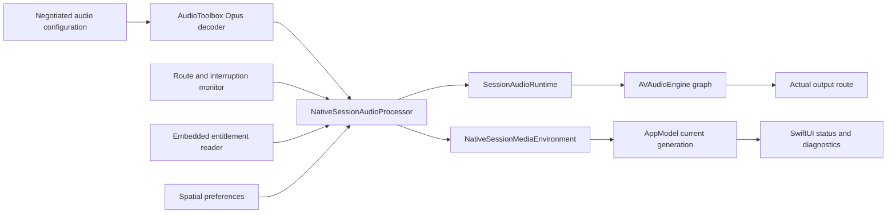

# LuneX 空间音频运行合同

## 范围与完成口径

本合同描述 LuneX 当前 production 音频路径如何把 Moonlight 协商出的
Opus/PCM 布局接入 Apple 原生音频 graph、route capability、空间音频、
head tracking、恢复、设置和诊断。它同时定义 OpenSpec
`integrate-spatial-audio-runtime` 的离线证据与任务 6.6 的物理验收边界。

以下结果不能单独证明端到端空间音频完成：

- unsigned 或 `CODE_SIGNING_ALLOWED=NO` 构建通过；
- entitlement plist 中存在 key；
- 对 `isListenerHeadTrackingEnabled` 或
  `intendedSpatialExperience` 完成赋值/读回；
- 单元测试、fake route、simulator 或静态 analyzer 通过；
- UI 显示 head tracked、一次主观试听或系统面板显示 Spatial Audio；
- 没有授权 Sunshine、实际 decoded PCM 和物理输出 route 的本机播放。

阶段 16 只有在确定性实现/验证和任务 6.6 的 signed、live、物理证据都完成后，
才可标记 `complete` 或 archive change。

## Production Ownership



- `NegotiatedAudioStreamConfiguration` 是协商布局的入口。
  decoder、PCM validator 和 graph 只使用同一份
  `StreamAudioChannelLayout` identity，不根据裸 channel count 再推断另一套顺序。
- `NativeSessionAudioProcessor` 独占 decoder、route monitor、
  `SessionAudioRuntime`、当前空间偏好、graph generation 和有界事件流。
- `SessionAudioRuntime` 串行化 schedule、route/spatial policy rebuild、
  interruption 和 stop。graph replacement 与 scheduling 共用 operation gate，
  旧 completion 不能释放或推进新 graph 的 buffer/clock。
- `NativeSessionMediaEnvironment` 只转发当前 session/media generation 的
  audio runtime event；同 session replacement、stop 或失败后拒绝旧 processor、
  preference completion 和 packet。
- `AppModel` 再按 active session/media generation、sequence 和 graph generation
  收敛 current state。stop、failure、reconnect 和 replacement 会先清当前空间状态，
  不能让旧 generation 的 head-tracked 状态继续显示。
- stop 顺序结束 route observation，再停止 graph/decoder，并 finish event stream。
  late route callback、late scheduled-buffer completion 和旧 UI preference task
  都不得恢复已停止 ownership。

## Channel Layout And PCM

所有运行配置固定为 48 kHz、interleaved signed Int16 PCM。只接受下列 canonical
layout：

| Moonlight 布局 | 语义顺序 | Channel mask | Core Audio tag | 空间资格 |
|---|---|---:|---|---|
| mono | FC | `0x0004` | `kAudioChannelLayoutTag_Mono` | nonspatial |
| stereo | FL, FR | `0x0003` | `kAudioChannelLayoutTag_Stereo` | ambience bed |
| WAVE 5.1 | FL, FR, FC, LFE, BL, BR | `0x003F` | `kAudioChannelLayoutTag_WAVE_5_1_A` | ambience bed |
| WAVE 7.1 | FL, FR, FC, LFE, BL, BR, SL, SR | `0x063F` | `kAudioChannelLayoutTag_WAVE_7_1` | ambience bed |

其他 channel count、layout/tag mismatch、buffer-list channel/byte mismatch、
非 48 kHz 或非 canonical layout 都 fail closed。空间 graph 失败时允许保留经过同一
PCM 合同验证的 direct-mixer 播放，但必须发布 typed fallback，不能伪装 spatial
active。

## Graph Contract

- Production client 始终附着一个 `AVAudioPlayerNode` 和一个
  `AVAudioEnvironmentNode`。
- eligible 空间路径连接
  `player -> environment -> mainMixer`，并要求实际 connection readback 成功。
- player 使用 `.ambienceBed` source mode；只有
  `applicableRenderingAlgorithms` 包含 `.auto` 时才选择 `.auto`。
- mono、用户关闭、route 不支持、output 不存在、entitlement/readback 不满足、
  layout mismatch 或 platform strategy 不兼容时进入 typed nonspatial fallback。
- environment 配置或 rendering algorithm 失败时先清 partial graph，再连接
  `player -> mainMixer`。旧 configuration、queue、head tracking 和 route ownership
  不得残留。
- schedule capacity 同时计入 queued 和 in-flight buffer。backend schedule 失败不
  消耗容量；completion 只释放对应 generation 的 buffer；stop 清 queue 并忽略
  late completion。
- reconfigure 先停止 player/engine、reset platform spatial state 并断开旧 graph，
  再原子建立新 graph。失败后不能 restart 旧 configuration。

## Platform Strategy

| 平台 | Route/capability 来源 | 空间 API | Head tracking |
|---|---|---|---|
| macOS | 实际 engine output format 与 graph readback | `AVAudioEnvironmentNode` | entitlement granted 时设置并读回 `isListenerHeadTrackingEnabled` |
| iOS/iPadOS | `AVAudioSession` active route、channel count 与 port `isSpatialAudioEnabled` | `AVAudioEnvironmentNode` | entitlement granted 时设置并读回 listener property |
| tvOS | `AVAudioSession` active route、channel count 与 spatial capability notification | `AVAudioEnvironmentNode` | entitlement granted 时设置并读回 listener property |
| visionOS | `AVAudioSession` route；不使用 unavailable listener property | output node `intendedSpatialExperience` | `.fixed` / `.headTracked` 类型读回；reset 为 `.bypassed` |

移动平台 activation 使用 playback category、48 kHz preferred sample rate、
latency buffer、`supportsMultichannelContent` 和不超过
`maximumOutputNumberOfChannels` 的 preferred output channel count。activation
中途失败会回滚 multichannel 声明、requested channel 和 active state；deactivate
失败也会清 adapter 自有状态。

route 支持只来自实际 API 状态，不从耳机/扬声器产品名猜测。macOS output name 只可
作为有界 route snapshot 信息，不能决定 spatial support。缺失 route 或无 output
时返回 unknown/unavailable，不默认为支持。

## Entitlement And Signing

head pose entitlement key 固定为：

```text
com.apple.developer.coremotion.head-pose
```

generator 管理以下文件和 build setting：

| Target | Entitlement file | 当前策略 |
|---|---|---|
| macOS | `Configuration/Entitlements/LuneX-macOS.entitlements` | key 为 `true` |
| iOS/iPadOS | `Configuration/Entitlements/LuneX-iOS.entitlements` | key 为 `true` |
| tvOS | `Configuration/Entitlements/LuneX-tvOS.entitlements` | key 为 `true` |
| visionOS | 无 head-pose entitlement file | 使用 visionOS output experience，保持平台分离 |

macOS 使用公开 Security API `SecTaskCreateFromSelf` /
`SecTaskCopyValueForEntitlement` 读取当前进程实际 embedded entitlement。
iOS/tvOS/visionOS public SDK 不暴露相同 `SecTaskCreateFromSelf` 范围，因此 production
reader 按平台可用边界 fail closed。missing、false、malformed、unreadable 和 API
unavailable 都不能当作 granted。

plist 和 unsigned build 只证明配置可生成，不证明 Apple Developer portal、
provisioning profile、签名产物或安装后的进程实际拥有 entitlement。任务 6.6 必须：

1. 记录脱敏的 Xcode/OS、设备类型、client commit 和签名 configuration。
2. 对 archive/app 的 code signature 与 embedded provisioning profile 做本地读回，
   证明 entitlement 同时存在于请求、profile 允许项和最终签名。
3. 在实际安装并启动的进程中记录 LuneX 的 privacy-bounded entitlement state；
   不记录 team ID、profile UUID、证书序列号或完整 entitlements dump。
4. 分别验证 missing/denied profile 的 fixed/nonspatial typed fallback，不能只验证
   granted happy path。

## Route, Recovery And Generation Rules

`SpatialAudioRouteMonitor` 观察 route change、interruption begin/end、
media-services lost/reset 和 spatial playback capability change。它发布 bounded、
deduplicated semantic revision：

- equivalent notification 不增加 revision；
- invalid capacity、revision exhaustion 和 conflicting revision fail closed；
- interruption 期间只保存最新 route/policy intent，不抢先重建 graph；
- resume 只用最新 intent 原子 replacement，并保持 media clock/concealment；
- media-services lost 进入 recovery，reset 后重新读取真实 route 再 rebuild；
- source replacement 移除旧 observers；stop/deinit finish stream 并抑制 late callback；
- graph failure 发布 failed state、停止 observation 和资源，不能继续消费 packet；
- consumer 自身取消不会隐式停止 processor ownership。

## Settings, UI And Diagnostics

- `spatialAudioEnabled` 与 `headTrackingEnabled` 使用向后兼容默认值和 JSON migration。
  Head Tracking control 在 Spatial Audio 关闭时 disabled。
- 当前 stream 中修改偏好会进入当前 media generation 的 processor；stale async
  completion 不能写回 replacement。
- stream overlay 和 Settings 都读取 `AppModel` 的 actual runtime state，而不是从
  desired preference 合成 active pill。
- 状态区分 inactive、nonspatial、fixed spatial、head tracked、vision fixed、
  vision head tracked、recovery 和 failed，并保留 typed fallback。
- Settings 在 compact/accessibility Dynamic Type 使用单列；wide 使用双列并由
  `ViewThatFits` 回退。文案使用 localizable resource，状态提供独立 accessibility
  label/value。
- diagnostics 使用固定 code/summary 和有界 history，不写 host、endpoint、route
  product name、raw entitlement、session UUID、channel samples 或 arbitrary error。
  spatial recovery 只清 audio action，不能覆盖 transport、decoder、HDR、input 或
  pairing ownership。

## Deterministic Verification

阶段 16 当前离线证据：

| Gate | 结果 | 证据 |
|---|---|---|
| Normal macOS | `721 total / 720 passed / 1 Keychain skip / 0 failed` | `/tmp/LuneX-16-6_1-normal.430OTY` |
| 五平台 Debug/Release | 10/10 succeeded，零 structured diagnostics | `/tmp/LuneX-16-6_2-builds.BW59PU` |
| Strict/API/analyzer | OpenSpec `7/7`；四 SDK C/API；owned bridge 0 finding | `/tmp/LuneX-16-6_3-repository-r2.L5luEV`、`/tmp/LuneX-16-6_3-analyzer.HjnMkl` |
| ASan | `721/720/1/0`，零 ASan/LSan report | `/tmp/LuneX-16-6_4-asan-final.PQ8zJN` |
| TSan | `721/720/1/0`，零 TSan report | `/tmp/LuneX-16-6_4-tsan-final.or1COq` |
| Malloc/resource | 11 suite、`185/185`，零 allocator report | `/tmp/LuneX-16-6_4-resource-final.v7bmDv` |
| Simulator identity | 三份快照一致，固定四实例 `Shutdown`，全局 `Booted=0` | `/tmp/LuneX-16-6_5-simulator-audit.ILGwlv` |
| Stage-level offline acceptance | fresh normal `721/720/1/0`；strict/generator/sanitizer/resource/simulator 组合门 | `/tmp/LuneX-16-stage-acceptance.SuOHsB`、`/tmp/LuneX-16-stage-gate.IC7uoV` |

normal、ASan 和 TSan 的唯一 skip 精确为：

```text
HostAndPersistenceTests/testRealKeychainIdentityRoundTripWhenExplicitlyEnabled()
```

所有普通测试显式移除 `LUNEX_RUN_KEYCHAIN_TEST`，继续使用 Debug 文件 fallback。
以上证据证明确定性 contract、SDK 编译、静态边界、内存/线程检测和资源释放，不证明
任务 6.6。

## Task 6.6 Physical Acceptance

### 前置条件

- 用户明确授权的 Sunshine host、版本、测试 app 和可中断测试窗口；
- 当前 LuneX commit 的 signed Debug/Release candidate；
- 至少一套兼容 head tracking 的 AirPods；
- built-in speaker、普通固定 stereo/nonspatial route；
- 可用时覆盖 wired/USB 和 HDMI 5.1/7.1 输出；
- 真实 iPhone/iPad、Mac、Apple TV；visionOS 需要实际设备或明确记录未授权/不可用；
- 脱敏证据目录，不保存 host token、PIN、private key、IP/MAC、设备序列号或原始音频。

### 必测矩阵

| 场景 | 必须观察 |
|---|---|
| Signed entitlement granted | 最终签名允许 head pose；actual runtime 从 fixed 进入 head tracked；readback 与 UI/diagnostic 一致 |
| Entitlement missing/denied | 不伪造 head tracked；稳定 fixed 或 nonspatial fallback；错误可恢复 |
| AirPods head tracking | 转头时声场相对屏幕/场景保持预期；关闭 Head Tracking 立即回 fixed；重新开启只影响当前 generation |
| Built-in speaker | route capability 与实际输出一致；无 AirPods 时不因产品名猜测 head tracking |
| Fixed stereo/nonspatial | 用户关闭、mono 或 unsupported route 均可听且 typed fallback 正确 |
| Wired/USB/HDMI 5.1/7.1 | 逐声道识别 FL/FR/FC/LFE/BL/BR/SL/SR；无交换、折叠、静音或错误 LFE |
| Route transition | AirPods、speaker、wired/HDMI 间切换时只有最新 route 生效；无旧 graph 重放、爆音、重复音频或状态卡死 |
| Interruption/media reset | 暂停期间不抢先 rebuild；恢复使用最新 route/policy，音频时钟与 concealment 连续 |
| Live Sunshine sync | 实际游戏/视频中音画同步、连续播放和输入响应可接受；记录可复现时间点而非一句主观结论 |
| Stop/reconnect/replacement | stop 后无残留音频、head tracking、observer 或 route ownership；重连不显示/播放旧 generation |

### 可接受收据

每行物理结果至少包含：

- UTC/本地时间、OS/Xcode、平台/设备类别、LuneX commit、签名 configuration；
- Sunshine 版本和测试内容的脱敏标识；
- negotiated layout、实际 route 类别、desired preference、actual presentation mode、
  fallback/diagnostic code；
- 操作步骤、预期、实际、pass/fail 和 clean teardown 结果；
- 对多声道使用可审计的 channel-identification 素材；对同步使用受控事件或测量方法；
- 失败时保留 privacy-bounded client log 和 host receipt 的时间关联。

不得把单元测试、simulator、unsigned build、API readback 或无测量的主观试听替代物理
矩阵。缺任何授权平台/route 时应明确写 `not run` 和阻塞原因，不能记为 pass。

## 当前结论

OpenSpec 当前为 `34/35 in_progress`。任务 1.1 至 6.5 和 6.7 的 production、
确定性验证、合同与阶段级离线证据已完成；任务 6.6 没有授权物理收据，保持
pending。change 不可 archive，阶段 16 不可标记 `complete`。
